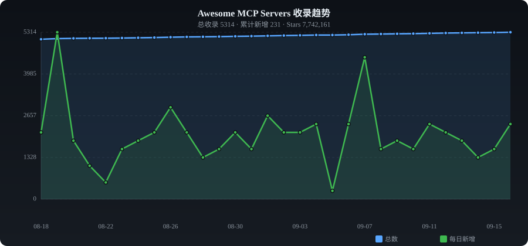

# ✨ Awesome MCP Servers

**English** | [中文](./README_ZH.md)

> Curated collection of MCP servers, clients & SDKs — auto-collected from GitHub

   

---

## 📈 Trends

---

## 📊 Category Stats

| Category | Count | Share |
|----------|------:|------:|
| 🏛️ Official & Reference | 282 | █ 5.4% |
| 🗄️ Database | 192 | █ 3.7% |
| ☁️ Cloud & Infrastructure | 217 | █ 4.2% |
| 🔧 Developer Tools | 1145 | ███████ 22.1% |
| 🔍 Search & Web | 471 | ███ 9.1% |
| 📁 File System | 68 | █ 1.3% |
| 🤖 AI & Models | 1905 | ████████████ 36.7% |
| 💬 Communication | 21 | █ 0.4% |
| 📋 Productivity | 34 | █ 0.7% |
| 📊 Data Processing | 86 | █ 1.7% |
| 🔐 Security & Auth | 82 | █ 1.6% |
| 📦 Others | 686 | ████ 13.2% |

---

## 🔥 Daily Trending (2026-08-31)

| # | Project | ⭐ | 📈 Gain | Description |
|:-:|---------|---:|-------:|-------------|
| 1 | [chopratejas/headroom](https://github.com/chopratejas/headroom) | 42,874 | +2560 | The Context Optimization Layer for LLM Applications |
| 2 | [affaan-m/everything-claude-code](https://github.com/affaan-m/everything-claude-code) | 186,213 | +990 | The agent harness performance optimization system. Skills, i |
| 3 | [diegosouzapw/OmniRoute](https://github.com/diegosouzapw/OmniRoute) | 58,981 | +626 | Never stop coding. The free AI gateway — one endpoint, 160+  |
| 4 | [miuuyy/codex-chatgpt-web](https://github.com/miuuyy/codex-chatgpt-web) | 3,054 | +515 | Use ChatGPT Web (including Pro) as a native model in the Cod |
| 5 | [affaan-m/ECC](https://github.com/affaan-m/ECC) | 244,942 | +464 | The agent harness performance optimization system. Skills, i |
| 6 | [punkpeye/awesome-mcp-servers](https://github.com/punkpeye/awesome-mcp-servers) | 93,561 | +455 | A collection of MCP servers. |
| 7 | [Graphify-Labs/graphify](https://github.com/Graphify-Labs/graphify) | 112,856 | +392 | Turn any codebase, with its docs, SQL schemas, configs, and  |
| 8 | [NanoNets/Graft](https://github.com/NanoNets/Graft) | 4,665 | +355 | Turbocharge Claude Code, Cursor, Codex, Gemini & every codin |
| 9 | [Panniantong/Agent-Reach](https://github.com/Panniantong/Agent-Reach) | 76,953 | +290 | Give your AI agent eyes to see the entire internet. Read & s |
| 10 | [can1357/oh-my-pi](https://github.com/can1357/oh-my-pi) | 28,632 | +235 | ⌥  AI Coding agent for the terminal — hash-anchored edits, o |
| 11 | [DeusData/codebase-memory-mcp](https://github.com/DeusData/codebase-memory-mcp) | 41,421 | +205 | MCP server that indexes your codebase into a persistent know |
| 12 | [butterbase-ai/butterbase-oss](https://github.com/butterbase-ai/butterbase-oss) | 1,006 | +204 | Open-source backend-as-a-service. Postgres, auth, storage, f |
| 13 | [farion1231/cc-switch](https://github.com/farion1231/cc-switch) | 130,342 | +184 | A cross-platform desktop All-in-One assistant tool for Claud |
| 14 | [D4Vinci/Scrapling](https://github.com/D4Vinci/Scrapling) | 77,460 | +177 | 🕷️ An adaptive Web Scraping framework that handles everythin |
| 15 | [koala73/worldmonitor](https://github.com/koala73/worldmonitor) | 85,158 | +171 | Real-time global intelligence dashboard. AI-powered news agg |
| 16 | [erickochen/purple](https://github.com/erickochen/purple) | 251 | +161 | Terminal SSH client with MCP support for AI agent integratio |
| 17 | [fuxicodex/Fuxi](https://github.com/fuxicodex/Fuxi) | 3,081 | +155 | FuXi is a fast, self-contained AI coding agent that lives in |
| 18 | [ruvnet/ruflo](https://github.com/ruvnet/ruflo) | 69,924 | +151 | 🌊 The leading agent orchestration platform for Claude. Deplo |
| 19 | [NVIDIA/SkillSpector](https://github.com/NVIDIA/SkillSpector) | 15,383 | +144 | Security scanner for AI agent skills. Detect vulnerabilities |
| 20 | [anthropics/claude-plugins-official](https://github.com/anthropics/claude-plugins-official) | 35,688 | +125 | Official, Anthropic-managed directory of high quality Claude |

---

## 📁 Categories

- [🏛️ Official & Reference](#official) (282)
- [🗄️ Database](#database) (192)
- [☁️ Cloud & Infrastructure](#cloud) (217)
- [🔧 Developer Tools](#dev-tools) (1145)
- [🔍 Search & Web](#web-search) (471)
- [📁 File System](#file-system) (68)
- [🤖 AI & Models](#ai-ml) (1905)
- [💬 Communication](#communication) (21)
- [📋 Productivity](#productivity) (34)
- [📊 Data Processing](#data) (86)
- [🔐 Security & Auth](#security) (82)
- [📦 Others](#other) (686)

---

### 🏛️ Official & Reference

| Project | ⭐ | Language | Description |
|---------|---:|:--------:|-------------|
| [modelcontextprotocol/servers](https://github.com/modelcontextprotocol/servers) | 89,986 | TypeScript | Model Context Protocol Servers |
| [sickn33/antigravity-awesome-skills](https://github.com/sickn33/antigravity-awesome-skills) | 42,601 | Python | The Ultimate Collection of 900+ Agentic Skills for Claude Code/Antigra |
| [anthropics/claude-plugins-official](https://github.com/anthropics/claude-plugins-official) | 35,688 | Python | Official, Anthropic-managed directory of high quality Claude Code Plug |
| [modelcontextprotocol/python-sdk](https://github.com/modelcontextprotocol/python-sdk) | 24,168 | Python | The official Python SDK for Model Context Protocol servers and clients |
| [microsoft/mcp-for-beginners](https://github.com/microsoft/mcp-for-beginners) | 17,124 | Jupyter Notebook | This open-source curriculum introduces the fundamentals of Model Conte |
| [NVIDIA/SkillSpector](https://github.com/NVIDIA/SkillSpector) | 15,383 | Python | Security scanner for AI agent skills. Detect vulnerabilities, maliciou |
| [modelcontextprotocol/typescript-sdk](https://github.com/modelcontextprotocol/typescript-sdk) | 13,286 | TypeScript | The official TypeScript SDK for Model Context Protocol servers and cli |
| [creativetimofficial/ui](https://github.com/creativetimofficial/ui) | 12,025 | TypeScript | Open-source components, blocks, and AI agents designed to speed up you |
| [mrexodia/ida-pro-mcp](https://github.com/mrexodia/ida-pro-mcp) | 11,713 | Python | AI-powered reverse engineering assistant that bridges IDA Pro with lan |
| [modelcontextprotocol/inspector](https://github.com/modelcontextprotocol/inspector) | 10,797 | TypeScript | Visual testing tool for MCP servers |
| [mcp-use/mcp-use](https://github.com/mcp-use/mcp-use) | 10,544 | TypeScript | The fullstack MCP framework to develop MCP Apps for ChatGPT / Claude & |
| [awslabs/mcp](https://github.com/awslabs/mcp) | 9,646 | Python | Official MCP Servers for AWS |
| [pietrozullo/mcp-use](https://github.com/mcp-use/mcp-use) | 9,344 | TypeScript | The fullstack MCP framework to develop MCP Apps for ChatGPT / Claude & |
| [modelcontextprotocol/modelcontextprotocol](https://github.com/modelcontextprotocol/modelcontextprotocol) | 9,089 | TypeScript | Specification and documentation for the Model Context Protocol |
| [modelcontextprotocol/registry](https://github.com/modelcontextprotocol/registry) | 7,207 | Go | A community driven registry service for Model Context Protocol (MCP) s |
| [modelcontextprotocol/go-sdk](https://github.com/modelcontextprotocol/go-sdk) | 5,042 | Go | The official Go SDK for Model Context Protocol servers and clients. Ma |
| [makenotion/notion-mcp-server](https://github.com/makenotion/notion-mcp-server) | 4,617 | TypeScript | Official Notion MCP Server |
| [homeassistant-ai/ha-mcp](https://github.com/homeassistant-ai/ha-mcp) | 4,578 | Python | The Unofficial and Awesome Home Assistant MCP Server |
| [modelcontextprotocol/csharp-sdk](https://github.com/modelcontextprotocol/csharp-sdk) | 4,501 | C# | The official C# SDK for Model Context Protocol servers and clients. Ma |
| [Pimzino/spec-workflow-mcp](https://github.com/Pimzino/spec-workflow-mcp) | 4,291 | TypeScript | A Model Context Protocol (MCP) server that provides structured spec-dr |
| [makenotion/notion-mcp](https://github.com/makenotion/notion-mcp-server) | 3,964 | TypeScript | Official Notion MCP Server |
| [modelcontextprotocol/rust-sdk](https://github.com/modelcontextprotocol/rust-sdk) | 3,859 | Rust | The official Rust SDK for the Model Context Protocol |
| [modelcontextprotocol/java-sdk](https://github.com/modelcontextprotocol/java-sdk) | 3,678 | Java | The official Java SDK for Model Context Protocol servers and clients.  |
| [microsoft/mcp](https://github.com/microsoft/mcp) | 3,627 | C# | Catalog of official Microsoft MCP (Model Context Protocol) server impl |
| [liaokongVFX/MCP-Chinese-Getting-Started-Guide](https://github.com/liaokongVFX/MCP-Chinese-Getting-Started-Guide) | 3,561 | - | Model Context Protocol(MCP) 编程极速入门 |
| [huangjunsen0406/py-xiaozhi](https://github.com/huangjunsen0406/py-xiaozhi) | 3,456 | Python | A Python-based Xiaozhi AI for users who want the full Xiaozhi experien |
| [metorial/metorial](https://github.com/metorial/metorial) | 3,226 | TypeScript | Connect any AI model to 600+ integrations; powered by MCP 📡 🚀 |
| [supermemoryai/apple-mcp](https://github.com/supermemoryai/apple-mcp) | 3,130 | TypeScript | Collection of apple-native tools for the model context protocol. |
| [snyk/agent-scan](https://github.com/snyk/agent-scan) | 2,985 | Python | Security scanner for AI agents, MCP servers and agent skills. |
| [modelcontextprotocol/ext-apps](https://github.com/modelcontextprotocol/ext-apps) | 2,775 | TypeScript | Official repo for spec & SDK of MCP Apps protocol - standard for UIs e |
| [perplexityai/modelcontextprotocol](https://github.com/perplexityai/modelcontextprotocol) | 2,493 | TypeScript | The official MCP server implementation for the Perplexity API Platform |
| [aws/agent-toolkit-for-aws](https://github.com/aws/agent-toolkit-for-aws) | 2,481 | Python | Official, AWS-supported MCP servers, skills, and plugins to help AI ag |
| [knowsuchagency/mcp2cli](https://github.com/knowsuchagency/mcp2cli) | 2,376 | Python | Turn any MCP server or OpenAPI spec into a CLI — at runtime, with zero |
| [modelcontextprotocol/mcpb](https://github.com/modelcontextprotocol/mcpb) | 2,092 | TypeScript | Desktop Extensions: One-click local MCP server installation in desktop |
| [chongdashu/unreal-mcp](https://github.com/chongdashu/unreal-mcp) | 2,071 | C++ | Enable AI assistant clients like Cursor, Windsurf and Claude Desktop t |
| [containers/kubernetes-mcp-server](https://github.com/containers/kubernetes-mcp-server) | 2,041 | Go | Model Context Protocol (MCP) server for Kubernetes and OpenShift |
| [ppl-ai/modelcontextprotocol](https://github.com/perplexityai/modelcontextprotocol) | 1,989 | TypeScript | The official MCP server implementation for the Perplexity API Platform |
| [forloopcodes/contextplus](https://github.com/forloopcodes/contextplus) | 1,977 | TypeScript | Semantic Intelligence for Large-Scale Engineering. Context+ is an MCP  |
| [minecraft-dev/MinecraftDev](https://github.com/minecraft-dev/MinecraftDev) | 1,786 | Kotlin | Plugin for IntelliJ IDEA that gives special support for Minecraft modd |
| [ForLoopCodes/contextplus](https://github.com/ForLoopCodes/contextplus) | 1,779 | TypeScript | Semantic Intelligence for Large-Scale Engineering. Context+ is an MCP  |

---

### 🗄️ Database

| Project | ⭐ | Language | Description |
|---------|---:|:--------:|-------------|
| [netdata/netdata](https://github.com/netdata/netdata) | 77,919 | C | The fastest path to AI-powered full stack observability, even for lean |
| [DeusData/codebase-memory-mcp](https://github.com/DeusData/codebase-memory-mcp) | 41,421 | Go | MCP server that indexes your codebase into a persistent knowledge grap |
| [mindsdb/mindsdb](https://github.com/mindsdb/mindsdb) | 38,602 | Python | Query Engine for AI Analytics: Build self-reasoning agents across all  |
| [OtterMind/Chat2DB](https://github.com/OtterMind/Chat2DB) | 28,056 | Java | Chat2DB is a free, cross-platform, local-first database client and SQL |
| [t8y2/dbx](https://github.com/t8y2/dbx) | 17,564 | Rust | 20 MB lightweight cross-platform database client for 70+ databases, in |
| [googleapis/mcp-toolbox](https://github.com/googleapis/mcp-toolbox) | 16,281 | Go | MCP Toolbox for Databases is an open source MCP server for databases. |
| [googleapis/genai-toolbox](https://github.com/googleapis/genai-toolbox) | 13,959 | Go | MCP Toolbox for Databases is an open source MCP server for databases. |
| [JoeanAmier/XHS-Downloader](https://github.com/JoeanAmier/XHS-Downloader) | 12,549 | Python | 小红书（XiaoHongShu、RedNote）链接提取/作品采集工具：提取账号发布、收藏、点赞、专辑作品链接；提取搜索结果作品、用户链接； |
| [tobymao/sqlglot](https://github.com/tobymao/sqlglot) | 8,971 | Python | Python SQL Parser and Transpiler |
| [Gentleman-Programming/engram](https://github.com/Gentleman-Programming/engram) | 6,242 | Go | Persistent memory system for AI coding agents. Agent-agnostic Go binar |
| [builderz-labs/mission-control](https://github.com/builderz-labs/mission-control) | 6,146 | TypeScript | Open-source dashboard for AI agent orchestration. Manage agent fleets, |
| [clidey/whodb](https://github.com/clidey/whodb) | 5,017 | Go | Where data access meets operational intelligence |
| [prest/prest](https://github.com/prest/prest) | 4,612 | Go | PostgreSQL ➕ REST, low-code, simplify and accelerate development, ⚡ in |
| [TabularisDB/tabularis](https://github.com/TabularisDB/tabularis) | 4,575 | TypeScript | A lightweight, cross-platform database client for developers. Supports |
| [NateBJones-Projects/OB1](https://github.com/NateBJones-Projects/OB1) | 4,527 | TypeScript | Open Brain — The infrastructure layer for your thinking. One database, |
| [panaversity/learn-agentic-ai](https://github.com/panaversity/learn-agentic-ai) | 4,350 | Jupyter Notebook | Learn Agentic AI using Dapr Agentic Cloud Ascent (DACA) Design Pattern |
| [bytebase/dbhub](https://github.com/bytebase/dbhub) | 3,434 | TypeScript | Zero-dependency, token-efficient database MCP server for Postgres, MyS |
| [butterbase-ai/butterbase](https://github.com/butterbase-ai/butterbase) | 3,357 | TypeScript | Open-source backend-as-a-service. Postgres, auth, storage, functions,  |
| [xpf0000/FlyEnv](https://github.com/xpf0000/FlyEnv) | 3,187 | TypeScript | Native local development environment for Windows, macOS & Linux. Run P |
| [supabase-community/supabase-mcp](https://github.com/supabase-community/supabase-mcp) | 2,497 | TypeScript | Connect Supabase to your AI assistants |
| [crbnos/carbon](https://github.com/crbnos/carbon) | 2,387 | TypeScript | Carbon is an open source ERP, MES and QMS for manufacturing. Perfect f |
| [crystaldba/postgres-mcp](https://github.com/crystaldba/postgres-mcp) | 2,216 | Python | Postgres MCP Pro provides configurable read/write access and performan |
| [benborla/mcp-server-mysql](https://github.com/benborla/mcp-server-mysql) | 2,091 | JavaScript | A Model Context Protocol server that provides read-only access to MySQ |
| [doobidoo/mcp-memory-service](https://github.com/doobidoo/mcp-memory-service) | 1,914 | Python | Open-source persistent memory for AI agent pipelines (LangGraph, CrewA |
| [Syngnat/GoNavi](https://github.com/Syngnat/GoNavi) | 1,887 | TypeScript | 原生轻量数据库客户端（Go + Wails + React，~30MB）：SQL/缓存/向量/消息/国产库，内置 AI 与 MCP，告别 E |
| [timescale/pg-aiguide](https://github.com/timescale/pg-aiguide) | 1,826 | Python | MCP server and Claude plugin for Postgres skills and documentation. He |
| [Azure/data-api-builder](https://github.com/Azure/data-api-builder) | 1,503 | C# | Data API builder provides modern REST, GraphQL endpoints and MCP tools |
| [designcomputer/mysql_mcp_server](https://github.com/designcomputer/mysql_mcp_server) | 1,377 | Python | A Model Context Protocol (MCP) server that enables secure interaction  |
| [Dataojitori/nocturne_memory](https://github.com/Dataojitori/nocturne_memory) | 1,338 | Python | 一个基于uri而不是RAG的轻量级、可回滚、可视化的 **AI 外挂MCP记忆库**。让你的 AI 拥有跨模型，跨会话，跨工具的持久的结构化 |
| [debba/tabularis](https://github.com/debba/tabularis) | 1,145 | TypeScript | A lightweight, developer-focused database management tool. Supports My |
| [mongodb-js/mongodb-mcp-server](https://github.com/mongodb-js/mongodb-mcp-server) | 1,116 | TypeScript | A Model Context Protocol server to connect to MongoDB databases and Mo |
| [TencentCloudBase/CloudBase-AI-Toolkit](https://github.com/TencentCloudBase/CloudBase-AI-Toolkit) | 1,087 | TypeScript | Backend for AI coding agents on CloudBase — database, auth, functions  |
| [saidsurucu/yargi-mcp](https://github.com/saidsurucu/yargi-mcp) | 1,086 | Python | MCP Server For Turkish Legal Databases |
| [sheshbabu/zen](https://github.com/sheshbabu/zen) | 1,071 | JavaScript | Selfhosted notes app. Single golang binary, notes stored as markdown w |
| [butterbase-ai/butterbase-oss](https://github.com/butterbase-ai/butterbase-oss) | 1,006 | TypeScript | Open-source backend-as-a-service. Postgres, auth, storage, functions,  |
| [neo4j-contrib/mcp-neo4j](https://github.com/neo4j-contrib/mcp-neo4j) | 980 | Python | Neo4j Labs Model Context Protocol servers |
| [Anarkh-Lee/universal-db-mcp](https://github.com/Anarkh-Lee/universal-db-mcp) | 921 | TypeScript | 通用数据库 MCP 连接器：支持 MySQL、PostgreSQL、Oracle、MongoDB 等 17 种数据库，支持 Claude D |
| [agentic-community/mcp-gateway-registry](https://github.com/agentic-community/mcp-gateway-registry) | 888 | Python | Enterprise-ready MCP Gateway & Registry that centralizes AI developmen |
| [statespace-tech/statespace](https://github.com/statespace-tech/statespace) | 871 | Rust | curl your filesystem and CLI tools |
| [alexander-zuev/supabase-mcp-server](https://github.com/alexander-zuev/supabase-mcp-server) | 830 | Python | Query MCP enables end-to-end management of Supabase via chat interface |

---

### ☁️ Cloud & Infrastructure

| Project | ⭐ | Language | Description |
|---------|---:|:--------:|-------------|
| [n8n-io/n8n](https://github.com/n8n-io/n8n) | 202,943 | TypeScript | Fair-code workflow automation platform with native AI capabilities. Co |
| [Kong/kong](https://github.com/Kong/kong) | 44,063 | Lua | 🦍 The API and AI Gateway |
| [SigNoz/signoz](https://github.com/SigNoz/signoz) | 31,980 | TypeScript | SigNoz is an open-source, OpenTelemetry-native observability platform  |
| [apache/apisix](https://github.com/apache/apisix) | 16,257 | Lua | The Cloud-Native API Gateway and AI Gateway |
| [triggerdotdev/trigger.dev](https://github.com/triggerdotdev/trigger.dev) | 16,170 | TypeScript | Trigger.dev – build and deploy fully‑managed AI agents and workflows |
| [cert-manager/cert-manager](https://github.com/cert-manager/cert-manager) | 13,635 | Go | Automatically provision and manage TLS certificates in Kubernetes |
| [0xJacky/nginx-ui](https://github.com/0xJacky/nginx-ui) | 11,467 | Go | Yet another WebUI for Nginx |
| [openstatusHQ/openstatus](https://github.com/openstatusHQ/openstatus) | 9,037 | TypeScript | 🫖 Status page with uptime monitoring & API monitoring as code   🫖 |
| [webiny/webiny-js](https://github.com/webiny/webiny-js) | 8,031 | TypeScript | Open-source, self-hosted CMS platform on AWS serverless (Lambda, Dynam |
| [oomol-lab/open-connector](https://github.com/oomol-lab/open-connector) | 5,450 | TypeScript | Open-source auth gateway connecting 1000+ SaaS providers to AI agents  |
| [microsandbox/microsandbox](https://github.com/zerocore-ai/microsandbox) | 4,889 | Rust | opensource self-hosted sandboxes for ai agents |
| [agentgateway/agentgateway](https://github.com/agentgateway/agentgateway) | 4,653 | Rust | Next Generation Agentic Proxy for AI Agents and MCP servers |
| [IBM/mcp-context-forge](https://github.com/IBM/mcp-context-forge) | 4,393 | Python | An AI Gateway, registry, and proxy that sits in front of any MCP, A2A, |
| [txn2/kubefwd](https://github.com/txn2/kubefwd) | 4,164 | Go | Bulk port forwarding Kubernetes services for local development. |
| [cloudflare/mcp-server-cloudflare](https://github.com/cloudflare/mcp-server-cloudflare) | 4,132 | TypeScript |  |
| [octelium/octelium](https://github.com/octelium/octelium) | 4,030 | Go | A next-gen FOSS self-hosted unified zero trust secure access platform  |
| [bethington/ghidra-mcp](https://github.com/bethington/ghidra-mcp) | 3,622 | Java | Ghidra MCP Server — 200+ MCP tools for AI-powered reverse engineering. |
| [skyhook-io/radar](https://github.com/skyhook-io/radar) | 3,178 | TypeScript | Modern Kubernetes visibility. Topology, event timeline, and service tr |
| [microsoft/skills](https://github.com/microsoft/skills) | 2,976 | TypeScript | Skills, MCP servers, Custom Agents, Agents.md for SDKs to ground Codin |
| [metatool-ai/metamcp](https://github.com/metatool-ai/metamcp) | 2,639 | TypeScript | MCP Aggregator, Orchestrator, Middleware, Gateway in one docker |
| [AmoyLab/Unla](https://github.com/AmoyLab/Unla) | 2,215 | TypeScript | 🧩 MCP Gateway - A lightweight gateway service that instantly transform |
| [metatool-ai/metatool-app](https://github.com/metatool-ai/metamcp) | 2,059 | TypeScript | MCP Aggregator, Orchestrator, Middleware, Gateway in one docker |
| [stacklok/toolhive](https://github.com/stacklok/toolhive) | 2,056 | Go | ToolHive makes deploying MCP servers easy, secure and fun |
| [amoylab/unla](https://github.com/AmoyLab/Unla) | 2,042 | TypeScript | 🧩 MCP Gateway - A lightweight gateway service that instantly transform |
| [microsoft/azure-devops-mcp](https://github.com/microsoft/azure-devops-mcp) | 1,986 | TypeScript | The MCP server for Azure DevOps, bringing the power of Azure DevOps di |
| [yomorun/yomo](https://github.com/yomorun/yomo) | 1,906 | Go | 🦖 Serverless AI Agent Framework with Geo-distributed Edge AI Infra. |
| [StacklokLabs/toolhive](https://github.com/stacklok/toolhive) | 1,623 | Go | ToolHive makes deploying MCP servers easy, secure and fun |
| [Stacklok/toolhive](https://github.com/stacklok/toolhive) | 1,623 | Go | ToolHive makes deploying MCP servers easy, secure and fun |
| [theNetworkChuck/docker-mcp-tutorial](https://github.com/theNetworkChuck/docker-mcp-tutorial) | 1,614 | - | Complete tutorial materials for building MCP servers with Docker - fro |
| [Flux159/mcp-server-kubernetes](https://github.com/Flux159/mcp-server-kubernetes) | 1,577 | TypeScript | MCP Server for kubernetes management commands |
| [hashicorp/terraform-mcp-server](https://github.com/hashicorp/terraform-mcp-server) | 1,515 | Go | The Terraform MCP Server provides seamless integration with Terraform  |
| [limecloud/lime](https://github.com/limecloud/lime) | 1,467 | TypeScript | Full-stack AI agent for coding, files, terminals, tools, research, con |
| [tianma-if/edgeever](https://github.com/tianma-if/edgeever) | 1,303 | HTML | Serverless, 100% free, and open-source Evernote alternative on Cloudfl |
| [ridafkih/keeper.sh](https://github.com/ridafkih/keeper.sh) | 1,266 | TypeScript | Open-source calendar sync tool. Aggregate events from Google, Outlook, |
| [Azure/azure-mcp](https://github.com/Azure/azure-mcp) | 1,223 | C# | The Azure MCP Server, bringing the power of Azure to your agents. |
| [awslabs/cli-agent-orchestrator](https://github.com/awslabs/cli-agent-orchestrator) | 1,166 | Python | Multi-agent orchestration for AI coding CLIs — Claude Code, Kiro, Code |
| [TencentCloudBase/CloudBase-MCP](https://github.com/TencentCloudBase/CloudBase-MCP) | 1,049 | TypeScript | CloudBase MCP - Connect CloudBase to your AI Agent.     Go from AI pro |
| [iannuttall/mcp-boilerplate](https://github.com/iannuttall/mcp-boilerplate) | 1,022 | TypeScript | A remote Cloudflare MCP server boilerplate with user authentication an |
| [openops-cloud/openops](https://github.com/openops-cloud/openops) | 1,012 | TypeScript | The batteries-included, No-Code FinOps automation platform, with the A |
| [TencentCloudBase/CloudBase-AI-ToolKit](https://github.com/TencentCloudBase/CloudBase-MCP) | 963 | TypeScript | CloudBase MCP - Connect CloudBase to your AI Agent.     Go from AI pro |

---

### 🔧 Developer Tools

| Project | ⭐ | Language | Description |
|---------|---:|:--------:|-------------|
| [farion1231/cc-switch](https://github.com/farion1231/cc-switch) | 130,342 | TypeScript | A cross-platform desktop All-in-One assistant tool for Claude Code, Co |
| [google-gemini/gemini-cli](https://github.com/google-gemini/gemini-cli) | 106,751 | TypeScript | An open-source AI agent that brings the power of Gemini directly into  |
| [Panniantong/Agent-Reach](https://github.com/Panniantong/Agent-Reach) | 76,953 | Python | Give your AI agent eyes to see the entire internet. Read & search Twit |
| [ComposioHQ/awesome-claude-skills](https://github.com/ComposioHQ/awesome-claude-skills) | 74,119 | Python | A curated list of awesome Claude Skills, resources, and tools for cust |
| [sickn33/agentic-awesome-skills](https://github.com/sickn33/agentic-awesome-skills) | 45,744 | Python | Installable GitHub library of 1,935+ agentic skills for Claude Code, C |
| [Hmbown/CodeWhale](https://github.com/Hmbown/CodeWhale) | 40,829 | Rust | Open-source coding agent for your terminal, built in Rust and on a jou |
| [mindsdb/mindshub](https://github.com/mindsdb/mindshub) | 39,667 | Makefile | Make AI do actual work. Swap the model anytime — keep everything you'v |
| [PostHog/posthog](https://github.com/PostHog/posthog) | 39,490 | Python | :hedgehog: PostHog is the leading platform for building self-driving p |
| [github/github-mcp-server](https://github.com/github/github-mcp-server) | 32,621 | Go | GitHub's official MCP Server |
| [mukul975/Anthropic-Cybersecurity-Skills](https://github.com/mukul975/Anthropic-Cybersecurity-Skills) | 31,772 | Python | 734+ structured cybersecurity skills for AI agents · MITRE ATT&CK mapp |
| [PrefectHQ/fastmcp](https://github.com/PrefectHQ/fastmcp) | 27,451 | Python | 🚀 The fast, Pythonic way to build MCP servers and clients. |
| [jlowin/fastmcp](https://github.com/PrefectHQ/fastmcp) | 23,286 | Python | 🚀 The fast, Pythonic way to build MCP servers and clients. |
| [mksglu/context-mode](https://github.com/mksglu/context-mode) | 20,272 | TypeScript | MCP is the protocol for tool access. We're the virtualization layer fo |
| [electerm/electerm](https://github.com/electerm/electerm) | 14,969 | JavaScript | 📻Terminal/ssh/sftp/ftp/telnet/serialport/RDP/VNC/Spice client(linux, m |
| [yusufkaraaslan/Skill_Seekers](https://github.com/yusufkaraaslan/Skill_Seekers) | 14,869 | Python | Convert documentation websites, GitHub repositories, and PDFs into Cla |
| [cyclotruc/gitingest](https://github.com/coderamp-labs/gitingest) | 14,048 | Python | Replace 'hub' with 'ingest' in any GitHub URL to get a prompt-friendly |
| [superset-sh/superset](https://github.com/superset-sh/superset) | 12,840 | TypeScript | IDE for the AI Agents Era - Run an army of Claude Code, Codex, etc. on |
| [0x4m4/hexstrike-ai](https://github.com/0x4m4/hexstrike-ai) | 11,462 | Python | HexStrike AI MCP Agents is an advanced MCP server that lets AI agents  |
| [OpenByteInc/QuantDinger](https://github.com/OpenByteInc/QuantDinger) | 11,260 | Python | AI quantitative trading platform for crypto, stocks, and forex with ba |
| [cobusgreyling/loop-engineering](https://github.com/cobusgreyling/loop-engineering) | 10,766 | JavaScript | Practical patterns, starters & CLI tools for loop engineering with AI  |
| [brokermr810/QuantDinger](https://github.com/brokermr810/QuantDinger) | 9,738 | Python | AI quantitative trading platform for crypto, stocks, and forex with ba |
| [wonderwhy-er/DesktopCommanderMCP](https://github.com/wonderwhy-er/DesktopCommanderMCP) | 9,451 | TypeScript | This is MCP server for Claude that gives it terminal control, file sys |
| [idosal/git-mcp](https://github.com/idosal/git-mcp) | 8,364 | TypeScript | Put an end to code hallucinations! GitMCP is a free, open-source, remo |
| [firerpa/lamda](https://github.com/firerpa/lamda) | 8,259 | Python | The most powerful Android RPA agent framework, next generation of mobi |
| [google-labs-code/stitch-skills](https://github.com/google-labs-code/stitch-skills) | 8,224 | TypeScript | A library of Agent Skills designed to work with the Stitch MCP server. |
| [jnMetaCode/superpowers-zh](https://github.com/jnMetaCode/superpowers-zh) | 7,912 | Shell | AI 编程超能力中文版 — superpowers 完整汉化 + 中国特色 skills（Gitee/Coding 工作流、中文排版、MCP |
| [maximhq/bifrost](https://github.com/maximhq/bifrost) | 7,688 | Go | Fastest enterprise AI gateway (50x faster than LiteLLM) with adaptive  |
| [yzfly/Awesome-MCP-ZH](https://github.com/yzfly/Awesome-MCP-ZH) | 7,616 | - | MCP 资源精选， MCP指南，Claude MCP，MCP Servers, MCP Clients |
| [rocketride-org/rocketride-server](https://github.com/rocketride-org/rocketride-server) | 7,573 | C++ | High-performance AI pipeline engine with a C++ core and 50+ Python-ext |
| [punkpeye/awesome-mcp-clients](https://github.com/punkpeye/awesome-mcp-clients) | 6,569 | - | A collection of MCP clients. |
| [getsentry/XcodeBuildMCP](https://github.com/getsentry/XcodeBuildMCP) | 6,314 | TypeScript | A Model Context Protocol (MCP) server and CLI that provides tools for  |
| [epiral/bb-browser](https://github.com/epiral/bb-browser) | 6,158 | TypeScript | Your browser is the API. CLI + MCP server for AI agents to control Chr |
| [kucherenko/jscpd](https://github.com/kucherenko/jscpd) | 6,082 | TypeScript | Copy/paste detector for programming source code, supports 223 formats. |
| [jacob-bd/gemini-notebook-mcp-cli](https://github.com/jacob-bd/gemini-notebook-mcp-cli) | 5,982 | Python | Programmatic access to Gemini Notebook - via command-line interface (C |
| [agent-infra/sandbox](https://github.com/agent-infra/sandbox) | 5,819 | Python | All-in-One Sandbox for AI Agents that combines Browser, Shell, File, M |
| [sooperset/mcp-atlassian](https://github.com/sooperset/mcp-atlassian) | 5,815 | Python | MCP server for Atlassian tools (Confluence, Jira) |
| [21st-dev/magic-mcp](https://github.com/21st-dev/magic-mcp) | 5,761 | TypeScript | It's like v0 but in your Cursor/WindSurf/Cline. 21st dev Magic MCP ser |
| [ZSeven-W/openpencil](https://github.com/ZSeven-W/openpencil) | 5,749 | TypeScript | AI-native open-source design tool. Design-as-Code.Prompt to UI on canv |
| [Q00/ouroboros](https://github.com/Q00/ouroboros) | 5,736 | Python | Agent OS: Stop prompting. Start specifying. A Socratic interview gates |
| [jacob-bd/notebooklm-mcp-cli](https://github.com/jacob-bd/notebooklm-mcp-cli) | 5,611 | Python | Programmatic access to Google NotebookLM — via command-line interface  |

---

### 🔍 Search & Web

| Project | ⭐ | Language | Description |
|---------|---:|:--------:|-------------|
| [D4Vinci/Scrapling](https://github.com/D4Vinci/Scrapling) | 77,460 | Python | 🕷️ An adaptive Web Scraping framework that handles everything from a s |
| [ChromeDevTools/chrome-devtools-mcp](https://github.com/ChromeDevTools/chrome-devtools-mcp) | 50,250 | TypeScript | Chrome DevTools for coding agents |
| [bytedance/UI-TARS-desktop](https://github.com/bytedance/UI-TARS-desktop) | 38,769 | TypeScript | The Open-Source Multimodal AI Agent Stack: Connecting Cutting-Edge AI  |
| [microsoft/playwright-mcp](https://github.com/microsoft/playwright-mcp) | 36,650 | TypeScript | Playwright MCP server |
| [assafelovic/gpt-researcher](https://github.com/assafelovic/gpt-researcher) | 29,219 | Python | An autonomous agent that conducts deep research on any data using any  |
| [casdoor/casdoor](https://github.com/casdoor/casdoor) | 14,301 | Go | An open-source AI-first Identity and Access Management (IAM) /AI MCP g |
| [hangwin/mcp-chrome](https://github.com/hangwin/mcp-chrome) | 12,363 | TypeScript | Chrome MCP Server is a Chrome extension-based Model Context Protocol ( |
| [firecrawl/firecrawl-mcp-server](https://github.com/firecrawl/firecrawl-mcp-server) | 7,356 | JavaScript | 🔥 Official Firecrawl MCP Server - Adds powerful web scraping and searc |
| [BrowserMCP/mcp](https://github.com/BrowserMCP/mcp) | 7,032 | TypeScript | Browser MCP is a Model Context Provider (MCP) server that allows AI ap |
| [MinishLab/semble](https://github.com/MinishLab/semble) | 5,970 | Python | Fast and Accurate Code Search for Agents. Uses ~98% fewer tokens than  |
| [netease-youdao/LobsterAI](https://github.com/netease-youdao/LobsterAI) | 5,966 | TypeScript | Open-source, desktop-grade AI agent that gets real work done — data an |
| [browsermcp/mcp](https://github.com/BrowserMCP/mcp) | 5,901 | TypeScript | Browser MCP is a Model Context Provider (MCP) server that allows AI ap |
| [joeseesun/qiaomu-anything-to-notebooklm](https://github.com/joeseesun/qiaomu-anything-to-notebooklm) | 5,898 | Python | Claude Skill: Multi-source content processor for NotebookLM. Supports  |
| [executeautomation/mcp-playwright](https://github.com/executeautomation/mcp-playwright) | 5,637 | TypeScript | Playwright Model Context Protocol Server - Tool to automate Browsers a |
| [mendableai/firecrawl-mcp-server](https://github.com/firecrawl/firecrawl-mcp-server) | 5,632 | JavaScript | 🔥 Official Firecrawl MCP Server - Adds powerful web scraping and searc |
| [0xNyk/awesome-hermes-agent](https://github.com/0xNyk/awesome-hermes-agent) | 5,510 | - | Independent directory of useful skills, plugins, memory providers, too |
| [apify/apify-mcp-server](https://github.com/apify/apify-mcp-server) | 5,472 | TypeScript | The Apify MCP server enables your AI agents to extract data from socia |
| [exa-labs/exa-mcp-server](https://github.com/exa-labs/exa-mcp-server) | 4,947 | TypeScript | Exa MCP for web search and web crawling! |
| [KnockOutEZ/wigolo](https://github.com/KnockOutEZ/wigolo) | 4,795 | TypeScript | The go-to web for your AI coding agent — local-first search, fetch, cr |
| [AgriciDaniel/claude-seo](https://github.com/AgriciDaniel/claude-seo) | 4,433 | Python | Universal SEO skill for Claude Code. 13 sub-skills, 6 subagents, exten |
| [open-webui/mcpo](https://github.com/open-webui/mcpo) | 4,359 | Python | A simple, secure MCP-to-OpenAPI proxy server |
| [Manavarya09/design-extract](https://github.com/Manavarya09/design-extract) | 3,988 | JavaScript | Extract any website's complete design system with one command. DTCG to |
| [Atmosphere/atmosphere](https://github.com/Atmosphere/atmosphere) | 3,797 | Java | The transport-agnostic real-time framework for the JVM. WebSocket, SSE |
| [Minidoracat/mcp-feedback-enhanced](https://github.com/Minidoracat/mcp-feedback-enhanced) | 3,775 | JavaScript | Enhanced MCP server for interactive user feedback and command executio |
| [nowork-studio/notfair-plugin](https://github.com/nowork-studio/notfair-plugin) | 3,434 | TypeScript | Open-source SEO, GEO, and marketing skills for AI agents. |
| [browserbase/mcp-server-browserbase](https://github.com/browserbase/mcp-server-browserbase) | 3,406 | TypeScript | Allow LLMs to control a browser with Browserbase and Stagehand |
| [asciimoo/hister](https://github.com/asciimoo/hister) | 3,372 | Go | Your own search engine |
| [stickerdaniel/linkedin-mcp-server](https://github.com/stickerdaniel/linkedin-mcp-server) | 3,285 | Python | This MCP server allows Claude and other AI assistants to access your L |
| [nowork-studio/NotFair](https://github.com/nowork-studio/NotFair) | 3,164 | Python | Open-source Claude Code skills for SEO, GEO, Google Ads, Meta Ads |
| [punitarani/fli](https://github.com/punitarani/fli) | 3,128 | Python | Google Flights MCP and Python Library |
| [blazickjp/arxiv-mcp-server](https://github.com/blazickjp/arxiv-mcp-server) | 3,098 | Python | A Model Context Protocol server for searching and analyzing arXiv pape |
| [taylorwilsdon/google_workspace_mcp](https://github.com/taylorwilsdon/google_workspace_mcp) | 3,095 | Python | Control Gmail, Google Calendar, Docs, Sheets, Slides, Chat, Forms, Tas |
| [miuuyy/codex-chatgpt-web](https://github.com/miuuyy/codex-chatgpt-web) | 3,054 | TypeScript | Use ChatGPT Web (including Pro) as a native model in the Codex app — w |
| [deedy5/ddgs](https://github.com/deedy5/ddgs) | 2,922 | Python | A metasearch library that aggregates results from diverse web search s |
| [Vexa-ai/vexa](https://github.com/Vexa-ai/vexa) | 2,730 | Python | Open-source meeting transcription API for Google Meet, Microsoft Teams |
| [papersgpt/papersgpt-for-zotero](https://github.com/papersgpt/papersgpt-for-zotero) | 2,620 | JavaScript | A powerful Zotero AI and MCP plugin with ChatGPT, Gemini 3.1, Claude,  |
| [brightdata/brightdata-mcp](https://github.com/brightdata/brightdata-mcp) | 2,618 | JavaScript | A powerful Model Context Protocol (MCP) server that provides an all-in |
| [nowork-studio/toprank](https://github.com/nowork-studio/toprank) | 2,615 | Python | Open-source Claude Code skills for SEO, GEO, Google Ads, Meta Ads |
| [tavily-ai/tavily-mcp](https://github.com/tavily-ai/tavily-mcp) | 2,363 | JavaScript | Production ready MCP server with real-time search, extract, map & craw |
| [srbhptl39/MCP-SuperAssistant](https://github.com/srbhptl39/MCP-SuperAssistant) | 2,313 | TypeScript | Brings MCP to ChatGPT, DeepSeek, Perplexity, Grok, Gemini, Google AI S |

---

### 📁 File System

| Project | ⭐ | Language | Description |
|---------|---:|:--------:|-------------|
| [mickael-kerjean/filestash](https://github.com/mickael-kerjean/filestash) | 13,684 | JavaScript | :file_folder: File Management Platform / Universal Data Access Layer ( |
| [rusq/slackdump](https://github.com/rusq/slackdump) | 2,768 | Go | Save or export your private and public Slack messages, threads, files, |
| [chatmcp/mcpso](https://github.com/chatmcp/mcpso) | 2,104 | TypeScript | directory for Awesome MCP Servers |
| [aklivity/zilla](https://github.com/aklivity/zilla) | 1,724 | Java | 🦎 A high-performance, multi-protocol gateway for Apache Kafka and AI.  |
| [mark3labs/mcp-filesystem-server](https://github.com/mark3labs/mcp-filesystem-server) | 678 | Go | Go server implementing Model Context Protocol (MCP) for filesystem ope |
| [featureform/enrichmcp](https://github.com/featureform/enrichmcp) | 644 | Python | EnrichMCP is a python framework for building data driven MCP servers |
| [ZeroPointRepo/awesome-hermes-skills](https://github.com/ZeroPointRepo/awesome-hermes-skills) | 484 | - | Curated, install-ready directory for the Hermes Agent ecosystem (v0.20 |
| [tugcantopaloglu/godot-mcp](https://github.com/tugcantopaloglu/godot-mcp) | 444 | JavaScript | MCP server for full Godot 4.x engine control — 149 tools for AI-driven |
| [evalstate/mcp-hfspace](https://github.com/evalstate/mcp-hfspace) | 385 | TypeScript | MCP Server to Use HuggingFace spaces, easy configuration and Claude De |
| [MorDavid/BloodHound-MCP-AI](https://github.com/MorDavid/BloodHound-MCP-AI) | 375 | Python | BloodHound-MCP-AI is integration that connects BloodHound with AI thro |
| [Arch1eSUN/Arcgentic](https://github.com/Arch1eSUN/Arcgentic) | 302 | Python | Mechanical plan/dev/self-audit/external-audit gates for AI coding agen |
| [admica/FileScopeMCP](https://github.com/admica/FileScopeMCP) | 281 | HTML | Analyzes your codebase identifying important files based on dependency |
| [8b-is/smart-tree](https://github.com/8b-is/smart-tree) | 229 | Rust | Smart Tree: not just a tree, a philosophy. A context-aware, AI-crafted |
| [cnych/seo-mcp](https://github.com/cnych/seo-mcp) | 225 | Python | A free SEO tool MCP (Model Control Protocol) service based on Ahrefs d |
| [piotr-agier/google-drive-mcp](https://github.com/piotr-agier/google-drive-mcp) | 209 | TypeScript | A Model Context Protocol (MCP) server that provides secure integration |
| [LeonardoCardoso/Poirot](https://github.com/a7t-ai/poirot) | 179 | Swift | A native macOS companion for Claude Code that lets you browse sessions |
| [jbeno/cursor-notebook-mcp](https://github.com/jbeno/cursor-notebook-mcp) | 157 | Python | Model Context Protocol (MCP) server designed to allow AI agents within |
| [raullenchai/vnsh](https://github.com/raullenchai/vnsh) | 155 | TypeScript | The Ephemeral Dropbox for AI. Host-blind, client-side encrypted sharin |
| [w0h1v/mcp-virustotal](https://github.com/w0h1v/mcp-virustotal) | 149 | TypeScript | MCP server for VirusTotal API — analyze URLs, files, IPs, and domains  |
| [TrNgTien/vfs](https://github.com/TrNgTien/vfs) | 141 | Go | Reduce AI agent token usage by 98% via Virtual Function Signatures. MC |
| [horw/esp-mcp](https://github.com/horw/esp-mcp) | 135 | Python | Centralize ESP32 related commands and simplify getting started with se |
| [answerlink/MCP-Workspace-Server](https://github.com/answerlink/MCP-Workspace-Server) | 133 | Python | 🚀 Beyond Filesystem - Complete AI Development Environment - One MCP Se |
| [unchase/antigravity-storage-manager](https://github.com/unchase/antigravity-storage-manager) | 102 | TypeScript | Unified AI Gateway with visual dashboard, secure Google Drive sync, Te |
| [ever-works/awesome-mcp-servers](https://github.com/ever-works/awesome-mcp-servers) | 100 | - | A curated list of the best MCP Servers, featuring top solutions, libra |
| [KorigamiK/markitdown_mcp_server](https://github.com/KorigamiK/markitdown_mcp_server) | 87 | Python | A Model Context Protocol (MCP) server that converts various file forma |
| [Bigsy/mcpmu](https://github.com/Bigsy/mcpmu) | 87 | Go | TUI-based MCP server multiplexer, configure all your MCP's in a single |
| [shariqriazz/vertex-ai-mcp-server](https://github.com/shariqriazz/vertex-ai-mcp-server) | 87 | TypeScript | MCP server for Vertex AI and Gemini tools, including grounded answers, |
| [iceener/files-stdio-mcp-server](https://github.com/iceener/files-stdio-mcp-server) | 75 | TypeScript | MCP Server for interacting with text-based files (read & write). Writt |
| [kushneryk/join.cloud](https://github.com/kushneryk/join.cloud) | 70 | TypeScript | Join.cloud lets AI agents work together in real-time rooms. Agents joi |
| [Erodenn/godot-mcp-runtime](https://github.com/Erodenn/godot-mcp-runtime) | 61 | TypeScript | A TypeScript MCP server that lets AI assistants interact with the Godo |
| [efforthye/fast-filesystem-mcp](https://github.com/efforthye/fast-filesystem-mcp) | 60 | TypeScript | A high-performance Model Context Protocol (MCP) server that provides s |
| [AsifKabirAntu/figsor](https://github.com/AsifKabirAntu/figsor) | 60 | JavaScript | Figsor is an MCP server that bridges Cursor to Figma, enabling chat-dr |
| [preloop/preloop](https://github.com/preloop/preloop) | 56 | Python | Preloop is the Governance Layer for AI agents: MCP firewall, model gat |
| [hodgesmr/agent-fecfile](https://github.com/hodgesmr/agent-fecfile) | 36 | Python | A Claude Code plugin + Agent Skill + MCP Server for analyzing Federal  |
| [r33drichards/mcp-js](https://github.com/r33drichards/mcp-js) | 36 | Rust | MCP server that exposes a V8 JavaScript runtime as a tool for AI agent |
| [inceptyon-labs/TARS](https://github.com/inceptyon-labs/TARS) | 35 | Rust | TARS is a centralized hub for discovering, creating, editing, and mana |
| [reeeeemo/ancestry-mcp](https://github.com/reeeeemo/ancestry-mcp) | 33 | Python | Ancestry MCP server made with Python that allows interactability with  |
| [thought2code/mcp-annotated-java-sdk](https://github.com/thought2code/mcp-annotated-java-sdk) | 32 | Java | Annotation-driven MCP dev 🚀 No Spring, Zero Boilerplate, Pure Java |
| [kejixiaoliang/awesome-dsh-plugins](https://github.com/kejixiaoliang/awesome-dsh-plugins) | 32 | JavaScript | DeepSeek Harness (DSH) 插件精选目录 — 14 类 280+ 个社区插件，覆盖 MCP / Skill / TUI / |
| [bx33661/Wireshark-MCP](https://github.com/bx33661/Wireshark-MCP) | 31 | Python | Wireshark-MCP，Give your AI assistant a packet analyzer. Drop a .pcap f |

---

### 🤖 AI & Models

| Project | ⭐ | Language | Description |
|---------|---:|:--------:|-------------|
| [affaan-m/ECC](https://github.com/affaan-m/ECC) | 244,942 | JavaScript | The agent harness performance optimization system. Skills, instincts,  |
| [affaan-m/everything-claude-code](https://github.com/affaan-m/everything-claude-code) | 186,213 | JavaScript | The agent harness performance optimization system. Skills, instincts,  |
| [langgenius/dify](https://github.com/langgenius/dify) | 153,989 | TypeScript | Production-ready platform for agentic workflow development. |
| [open-webui/open-webui](https://github.com/open-webui/open-webui) | 125,426 | Python | User-friendly AI Interface (Supports Ollama, OpenAI API, ...) |
| [Graphify-Labs/graphify](https://github.com/Graphify-Labs/graphify) | 112,856 | Python | Turn any codebase, with its docs, SQL schemas, configs, and PDFs, into |
| [punkpeye/awesome-mcp-servers](https://github.com/punkpeye/awesome-mcp-servers) | 93,561 | - | A collection of MCP servers. |
| [koala73/worldmonitor](https://github.com/koala73/worldmonitor) | 85,158 | TypeScript | Real-time global intelligence dashboard. AI-powered news aggregation,  |
| [lobehub/lobehub](https://github.com/lobehub/lobehub) | 82,121 | TypeScript | The ultimate space for work and life — to find, build, and collaborate |
| [infiniflow/ragflow](https://github.com/infiniflow/ragflow) | 74,020 | Python | RAGFlow is a leading open-source Retrieval-Augmented Generation (RAG)  |
| [lobehub/lobe-chat](https://github.com/lobehub/lobehub) | 72,885 | TypeScript | The ultimate space for work and life — to find, build, and collaborate |
| [ruvnet/ruflo](https://github.com/ruvnet/ruflo) | 69,924 | TypeScript | 🌊 The leading agent orchestration platform for Claude. Deploy intellig |
| [headroomlabs-ai/headroom](https://github.com/headroomlabs-ai/headroom) | 68,159 | Python | Compress tool outputs, logs, files, and RAG chunks before they reach t |
| [sansan0/TrendRadar](https://github.com/sansan0/TrendRadar) | 61,959 | Python | ⭐AI-driven public opinion & trend monitor with multi-platform aggregat |
| [upstash/context7](https://github.com/upstash/context7) | 61,439 | TypeScript | Context7 MCP Server -- Up-to-date code documentation for LLMs and AI c |
| [diegosouzapw/OmniRoute](https://github.com/diegosouzapw/OmniRoute) | 58,981 | TypeScript | Never stop coding. The free AI gateway — one endpoint, 160+ providers, |
| [zylon-ai/private-gpt](https://github.com/zylon-ai/private-gpt) | 57,491 | Python | Complete API layer for private AI applications on local models: RAG, s |
| [MemPalace/mempalace](https://github.com/MemPalace/mempalace) | 56,420 | Python | The best-benchmarked open-source AI memory system. And it's free. |
| [Mintplex-Labs/anything-llm](https://github.com/Mintplex-Labs/anything-llm) | 55,268 | JavaScript | The all-in-one Desktop & Docker AI application with built-in RAG, AI a |
| [aaif-goose/goose](https://github.com/aaif-goose/goose) | 50,223 | Rust | an open source, extensible AI agent that goes beyond code suggestions  |
| [HKUDS/nanobot](https://github.com/HKUDS/nanobot) | 47,568 | Python | Ultra-lightweight, open-source, self-hosted personal AI agent framewor |
| [upstash/context7-mcp](https://github.com/upstash/context7) | 47,411 | TypeScript | Context7 MCP Server -- Up-to-date code documentation for LLMs and AI c |
| [zhayujie/CowAgent](https://github.com/zhayujie/CowAgent) | 46,736 | Python | CowAgent (chatgpt-on-wechat) 是基于大模型的超级AI助理，能主动思考和任务规划、访问操作系统和外部资源、创造和执 |
| [mudler/LocalAI](https://github.com/mudler/LocalAI) | 44,200 | Go | :robot: The free, Open Source alternative to OpenAI, Claude and others |
| [zhayujie/chatgpt-on-wechat](https://github.com/zhayujie/chatgpt-on-wechat) | 42,968 | Python | CowAgent是基于大模型的超级AI助理，能主动思考和任务规划、访问操作系统和外部资源、创造和执行Skills、拥有长期记忆并不断成长。同 |
| [chopratejas/headroom](https://github.com/chopratejas/headroom) | 42,874 | Python | The Context Optimization Layer for LLM Applications |
| [danny-avila/LibreChat](https://github.com/danny-avila/LibreChat) | 42,645 | TypeScript | Enhanced ChatGPT Clone: Features Agents, MCP, DeepSeek, Anthropic, AWS |
| [amruthpillai/reactive-resume](https://github.com/amruthpillai/reactive-resume) | 41,991 | TypeScript | A one-of-a-kind resume builder that keeps your privacy in mind. Comple |
| [AstrBotDevs/AstrBot](https://github.com/AstrBotDevs/AstrBot) | 39,846 | Python | Agentic IM Chatbot infrastructure that integrates lots of IM platforms |
| [wshobson/agents](https://github.com/wshobson/agents) | 39,292 | Python | Multi-harness agentic plugin marketplace for Claude Code, Codex CLI, C |
| [BerriAI/litellm](https://github.com/BerriAI/litellm) | 37,459 | Python | Python SDK, Proxy Server (AI Gateway) to call 100+ LLM APIs in OpenAI  |
| [block/goose](https://github.com/block/goose) | 32,107 | Rust | an open source, extensible AI agent that goes beyond code suggestions  |
| [tirth8205/code-review-graph](https://github.com/tirth8205/code-review-graph) | 31,036 | Python | Local knowledge graph for Claude Code. Builds a persistent map of your |
| [ComposioHQ/composio](https://github.com/ComposioHQ/composio) | 29,975 | TypeScript | Composio powers 1000+ toolkits, tool search, context management, authe |
| [labring/FastGPT](https://github.com/labring/FastGPT) | 29,518 | TypeScript | FastGPT is a knowledge-based platform built on the LLMs, offers a comp |
| [oraios/serena](https://github.com/oraios/serena) | 28,681 | Python | A powerful coding agent toolkit providing semantic retrieval and editi |
| [can1357/oh-my-pi](https://github.com/can1357/oh-my-pi) | 28,632 | TypeScript | ⌥  AI Coding agent for the terminal — hash-anchored edits, optimized t |
| [yamadashy/repomix](https://github.com/yamadashy/repomix) | 28,135 | TypeScript | 📦 Repomix is a powerful tool that packs your entire repository into a  |
| [ahujasid/blender-mcp](https://github.com/ahujasid/blender-mcp) | 26,546 | Python |  |
| [MCPBlender/blender-mcp](https://github.com/MCPBlender/blender-mcp) | 25,663 | Python | 🎨 Control Blender 3D with Claude AI — prompt-driven 3D modeling, mater |
| [a2aproject/A2A](https://github.com/a2aproject/A2A) | 24,483 | Shell | Agent2Agent (A2A) is an open protocol enabling communication and inter |

---

### 💬 Communication

| Project | ⭐ | Language | Description |
|---------|---:|:--------:|-------------|
| [KroMiose/nekro-agent](https://github.com/KroMiose/nekro-agent) | 1,108 | Python | NekroAgent 是一个面向多人互动场景的跨平台 Agent 框架，集 Claude Code 沙盒执行、工作区编排、长期记忆、结构化  |
| [TryCaspian/caspian-sdk](https://github.com/TryCaspian/caspian-sdk) | 941 | Python | One identity for your AI agent across Slack, Discord, Telegram, WhatsA |
| [InditexTech/mcp-teams-server](https://github.com/InditexTech/mcp-teams-server) | 394 | Python | An MCP (Model Context Protocol) server implementation for Microsoft Te |
| [Wh1isper/mcp-email-server](https://github.com/Wh1isper/mcp-email-server) | 318 | Python | Full-featured, multi-account MCP email server for Windows, macOS, and  |
| [tokencanopy/e2a](https://github.com/tokencanopy/e2a) | 184 | Go | The first open source email gateway for AI agents — SPF/DKIM verified  |
| [v-3/discordmcp](https://github.com/v-3/discordmcp) | 177 | TypeScript | Discord MCP Server for Claude Integration |
| [gebruder/wirken](https://github.com/gebruder/wirken) | 169 | Rust | Secure AI agent gateway. 8 LLM providers, 6 channels, MCP, SIEM forwar |
| [agenticmail/agenticmail](https://github.com/agenticmail/agenticmail) | 135 | TypeScript | Email, SMS & phone-call infrastructure for AI agents — send and receiv |
| [zhinjs/zhin](https://github.com/zhinjs/zhin) | 135 | TypeScript | AI-native TypeScript bot framework — one codebase for 20+ chat platfor |
| [nirholas/pump-fun-sdk](https://github.com/nirholas/pump-fun-sdk) | 119 | Rust | Token creation launching, bonding curve trading, AMM migration, tiered |
| [trifillara/moltis-gateway-mcp](https://github.com/trifillara/moltis-gateway-mcp) | 98 | Rust | personal agent server mcp with multi-provider LLMs, voice, memory, Tel |
| [Cactusinhand/mcp_server_notify](https://github.com/Cactusinhand/mcp_server_notify) | 49 | Python | Send system notification when Agent task is done. |
| [yunfeizhu/mcp-mail-server](https://github.com/yunfeizhu/mcp-mail-server) | 44 | TypeScript | A lightweight Model Context Protocol (MCP) server that provides IMAP a |
| [nirholas/mcp-notify](https://github.com/nirholas/mcp-notify) | 28 | Go | Monitor the Model Context Protocol (MCP) Registry for new, updated, an |
| [mikechao/balldontlie-mcp](https://github.com/mikechao/balldontlie-mcp) | 23 | JavaScript | An MCP Server implementation that integrates the Balldontlie API, to p |
| [arifszn/reminder-mcp](https://github.com/arifszn/reminder-mcp) | 15 | TypeScript | A MCP server for scheduling and triggering reminders via Slack or Tele |
| [Lifecycle-Innovations-Limited/claude-ops](https://github.com/Lifecycle-Innovations-Limited/claude-ops) | 9 | Shell | Business operating system for Claude Code — 25 skills, 13 agents, smar |
| [kts-kris/uHorse](https://github.com/kts-kris/uHorse) | 8 | Rust | 🦄 Enterprise-grade multi-channel AI gateway and agent framework in Rus |
| [composio-community/claude-code-as-openclaw](https://github.com/composio-community/claude-code-as-openclaw) | 6 | TypeScript | OpenClaudeClaw — Claude Code with persistent gateway, multi-channel me |
| [n24q02m/better-email-mcp](https://github.com/n24q02m/better-email-mcp) | 5 | TypeScript | MCP server for Email (IMAP/SMTP) - composite tools optimized for AI ag |
| [lanchuske/local-mcp-releases](https://github.com/lanchuske/local-mcp-releases) | 5 | JavaScript | LMCP — Give your AI native access to Mac apps. Mail, Calendar, Teams,  |

---

### 📋 Productivity

| Project | ⭐ | Language | Description |
|---------|---:|:--------:|-------------|
| [MarkusPfundstein/mcp-obsidian](https://github.com/MarkusPfundstein/mcp-obsidian) | 4,357 | Python | MCP server that interacts with Obsidian via the Obsidian rest API comm |
| [coddingtonbear/obsidian-local-rest-api](https://github.com/coddingtonbear/obsidian-local-rest-api) | 2,873 | TypeScript | A secure REST API and Model Context Protocol (MCP) server for your vau |
| [suekou/mcp-notion-server](https://github.com/suekou/mcp-notion-server) | 922 | TypeScript |  |
| [infiolab/infio-copilot](https://github.com/infiolab/infio-copilot) | 663 | TypeScript | A Cursor-inspired AI assistant for Obsidian that offers smart autocomp |
| [StevenStavrakis/obsidian-mcp](https://github.com/StevenStavrakis/obsidian-mcp) | 652 | TypeScript | A simple MCP server for Obsidian |
| [opendatalab/MinerU-Document-Explorer](https://github.com/opendatalab/MinerU-Document-Explorer) | 627 | TypeScript | Agent-native knowledge engine with MCP tools for document indexing, wi |
| [vivekVells/mcp-pandoc](https://github.com/vivekVells/mcp-pandoc) | 505 | Python | MCP server for document format conversion using pandoc. |
| [delorenj/mcp-server-trello](https://github.com/delorenj/mcp-server-trello) | 435 | TypeScript | A Model Context Protocol (MCP) server that provides tools for interact |
| [abhiz123/todoist-mcp-server](https://github.com/abhiz123/todoist-mcp-server) | 389 | JavaScript | MCP server for Todoist integration enabling natural language task mana |
| [iansinnott/obsidian-claude-code-mcp](https://github.com/iansinnott/obsidian-claude-code-mcp) | 345 | TypeScript | Connect Claude Code and other AI tools to your Obsidian notes using Mo |
| [newtype-01/obsidian-mcp](https://github.com/newtype-01/obsidian-mcp) | 312 | JavaScript | Obsidian MCP (Model Context Protocol) Server |
| [danhilse/notion_mcp](https://github.com/danhilse/notion_mcp) | 206 | Python | A simple MCP integration that allows Claude to read and manage a perso |
| [FradSer/mcp-server-apple-events](https://github.com/FradSer/mcp-server-apple-events) | 196 | TypeScript | MCP server providing native macOS integration with Apple Reminders and |
| [entanglr/zettelkasten-mcp](https://github.com/entanglr/zettelkasten-mcp) | 163 | Python | A Model Context Protocol (MCP) server that implements the Zettelkasten |
| [KonghaYao/peri](https://github.com/KonghaYao/peri) | 158 | Rust | Lightweight (14MB) ACP-first Agent, Claude Code Plugin compatible, ful |
| [Epistates/turbovault](https://github.com/Epistates/turbovault) | 149 | Rust | Markdown and OFM SDK w/ MCP server that transforms your Obsidian vault |
| [sirmews/apple-notes-mcp](https://github.com/sirmews/apple-notes-mcp) | 125 | Python | Read your Apple Notes with Claude Model Context Protocol |
| [roychri/mcp-server-asana](https://github.com/roychri/mcp-server-asana) | 124 | TypeScript |  |
| [jjsantos01/jupyter-notebook-mcp](https://github.com/jjsantos01/jupyter-notebook-mcp) | 121 | Jupyter Notebook | A Model Context Protocol (MCP) for Jupyter Notebook |
| [jkawamoto/mcp-bear](https://github.com/jkawamoto/mcp-bear) | 76 | Python | A MCP server for interacting with Bear note-taking software. |
| [thejacedev/Noteriv](https://github.com/thejacedev/Noteriv) | 76 | TypeScript | A fast, open-source markdown editor. Graph view, plugin API, themes, G |
| [stanislavlysenko0912/todoist-mcp-server](https://github.com/stanislavlysenko0912/todoist-mcp-server) | 57 | TypeScript | Full implementation of Todoist Rest API & support Todoist Sync API for |
| [OpaqueGlass/syplugin-anMCPServer](https://github.com/OpaqueGlass/syplugin-anMCPServer) | 46 | TypeScript | A plugin that provide simple MCP service for Siyuan-note |
| [raphasouthall/neurostack](https://github.com/raphasouthall/neurostack) | 45 | Python | Your second brain, starting today. CLI + MCP server that helps you bui |
| [velvetmonkey/flywheel-memory](https://github.com/velvetmonkey/flywheel-memory) | 45 | TypeScript | MCP server giving AI a knowledge graph over Obsidian vaults. 13-layer  |
| [akseyh/bear-mcp-server](https://github.com/akseyh/bear-mcp-server) | 42 | JavaScript | MCP Server integration for Bear note app |
| [n24q02m/better-notion-mcp](https://github.com/n24q02m/better-notion-mcp) | 31 | TypeScript | Markdown-first MCP server for Notion API - composite tools optimized f |
| [Badhansen/notion-mcp](https://github.com/Badhansen/notion-mcp) | 29 | Python | A simple Model Context Protocol (MCP) server that integrates with Noti |
| [notedit/awesome-mcp-list](https://github.com/notedit/awesome-mcp-list) | 28 | - | Awesome Model Context Protocol Service List |
| [anpigon/mcp-server-obsidian-omnisearch](https://github.com/anpigon/mcp-server-obsidian-omnisearch) | 27 | Python | An MCP server that enables searches within Obsidian vaults using the O |
| [rygwdn/obsidian-mcp-plugin](https://github.com/rygwdn/obsidian-mcp-plugin) | 11 | TypeScript | Obsidian plugin providing Model Context Protocol (MCP) integration |
| [smith-and-web/obsidian-mcp-server](https://github.com/smith-and-web/obsidian-mcp-server) | 11 | TypeScript | MCP server for Obsidian vault management - enables Claude and other AI |
| [jlevere/obsidian-mcp-plugin](https://github.com/jlevere/obsidian-mcp-plugin) | 9 | TypeScript | Allow an LLM to interact with your notes in Obsidian via MCP |
| [steipete/notarium-mcp](https://github.com/steipete/notarium-mcp) | 7 | TypeScript | Notarium: encrypted Simplenote → MCP gateway, built for speed and clar |

---

### 📊 Data Processing

| Project | ⭐ | Language | Description |
|---------|---:|:--------:|-------------|
| [open-metadata/OpenMetadata](https://github.com/open-metadata/OpenMetadata) | 15,040 | TypeScript | OpenMetadata is a unified metadata platform for data discovery, data o |
| [Zipstack/unstract](https://github.com/Zipstack/unstract) | 7,182 | Python | LLM-Driven Extraction of Unstructured Data — Built for API Deployments |
| [microsoft/flint-chart](https://github.com/microsoft/flint-chart) | 4,073 | TypeScript | 🪄 Flint is a visualization language that lets AI agents reliably creat |
| [dagucloud/dagu](https://github.com/dagucloud/dagu) | 3,825 | Go | Lightweight, powerful workflow engine built in a single binary with We |
| [mckinsey/vizro](https://github.com/mckinsey/vizro) | 3,584 | Python | Vizro is a low-code toolkit for building high-quality data visualizati |
| [julien040/anyquery](https://github.com/julien040/anyquery) | 1,771 | Go | Query anything (GitHub, Notion, +40 more) with SQL and let LLMs (ChatG |
| [slothflowlabs/duckle](https://github.com/slothflowlabs/duckle) | 1,252 | Rust | Open-source self-hosted ETL and ELT tool on DuckDB. Low-code visual da |
| [negokaz/excel-mcp-server](https://github.com/negokaz/excel-mcp-server) | 1,016 | Go | A Model Context Protocol (MCP) server that reads and writes MS Excel d |
| [artokun/comfyui-mcp](https://github.com/artokun/comfyui-mcp) | 705 | TypeScript | ComfyUI MCP server + Claude Code plugin — workflow execution, visualiz |
| [cohnen/mcp-google-ads](https://github.com/cohnen/mcp-google-ads) | 701 | Python | An MCP tool that connects Google Ads with Claude AI/Cursor and others, |
| [dbt-labs/dbt-mcp](https://github.com/dbt-labs/dbt-mcp) | 601 | Python | A MCP (Model Context Protocol) server for interacting with dbt. |
| [ZubeidHendricks/youtube-mcp-server](https://github.com/ZubeidHendricks/youtube-mcp-server) | 450 | TypeScript | MCP Server for YouTube API, enabling video management, Shorts creation |
| [secondsky/sap-skills](https://github.com/secondsky/sap-skills) | 428 | JavaScript | Production-ready plugins for SAP development with AI coding assistants |
| [joenorton/comfyui-mcp-server](https://github.com/joenorton/comfyui-mcp-server) | 402 | Python | lightweight Python-based MCP (Model Context Protocol) server for local |
| [cisco-open/network-sketcher](https://github.com/cisco-open/network-sketcher) | 386 | Python | Network Sketcher is an AI-ready network design tool with Local MCP, On |
| [ryaker/outlook-mcp](https://github.com/ryaker/outlook-mcp) | 316 | JavaScript | MCP server for Claude to access Outlook data via Microsoft Graph API |
| [surendranb/google-analytics-mcp](https://github.com/surendranb/google-analytics-mcp) | 238 | Python | Google Analytics 4 MCP Server for Claude, Cursor, Windsurf etc - Acces |
| [darjeeling/awesome-mcp-korea](https://github.com/darjeeling/awesome-mcp-korea) | 238 | - | A curated list of MCP servers for the Korean market, including legal,  |
| [sv-grid/sv-grid](https://github.com/sv-grid/sv-grid) | 214 | TypeScript | Native Svelte 5 data grid. Headless-first engine + drop-in render comp |
| [toolsdk-ai/toolsdk-mcp-registry](https://github.com/toolsdk-ai/toolsdk-mcp-registry) | 186 | TypeScript | MCPSDK.dev(ToolSDK.ai)'s Awesome MCP Servers and Packages Registry and |
| [ThHanke/ontosphere](https://github.com/ThHanke/ontosphere) | 172 | TypeScript | Browser-based RDF/ontology knowledge graph editor — load RDF from file |
| [CCCpan/data-verify-mcp](https://github.com/CCCpan/data-verify-mcp) | 168 | TypeScript | 中国数据核验 MCP Server | 身份核验/企业查询/车辆信息/OCR识别/风险评估 | 10个Tool覆盖5大类 | 微信: che |
| [MLT-OSS/FirstData](https://github.com/MLT-OSS/FirstData) | 129 | Python | The World's Most Comprehensive, Authoritative, and Structured Open Sou |
| [the-momentum/apple-health-mcp-server](https://github.com/the-momentum/apple-health-mcp-server) | 126 | Python | MCP server for querying Apple Health data with natural language using  |
| [cobanov/teslamate-mcp](https://github.com/cobanov/teslamate-mcp) | 119 | Python | A Model Context Protocol (MCP) server that provides access to your Tes |
| [win4r/codebase-memory-mcp-pro](https://github.com/win4r/codebase-memory-mcp-pro) | 98 | C | Community fork of DeusData/codebase-memory-mcp (MIT) — incremental-rei |
| [QuantGeekDev/coincap-mcp](https://github.com/QuantGeekDev/coincap-mcp) | 90 | TypeScript | A coincap mcp server to access crypto data from coincap API |
| [GongRzhe/JSON-MCP-Server](https://github.com/GongRzhe/JSON-MCP-Server) | 88 | JavaScript | JSON handling and processing mcp server |
| [yzfly/mcp-excel-server](https://github.com/yzfly/mcp-excel-server) | 83 | Python | The Excel MCP Server is a powerful tool that enables natural language  |
| [keboola/keboola-mcp-server](https://github.com/keboola/mcp-server) | 81 | Python | Model Context Protocol (MCP) Server for the Keboola Platform |
| [calvernaz/alphavantage](https://github.com/calvernaz/alphavantage) | 73 | Python | A MCP server for the stock market data API, Alphavantage API. |
| [garethbeaumo/originlab-mcp](https://github.com/garethbeaumo/originlab-mcp) | 73 | Python | MCP Server for OriginLab  Control OriginLab with natural language thro |
| [FROWNINGdev/django-orm-lens](https://github.com/FROWNINGdev/django-orm-lens) | 72 | Python | Free, MIT alternative to paid Django schema review. Blast radius on ev |
| [hanlulong/openecon-data](https://github.com/hanlulong/openecon-data) | 69 | Python | Give your AI agent accurate economic data. 330K indicators from FRED,  |
| [the-momentum/fhir-mcp-server](https://github.com/the-momentum/fhir-mcp-server) | 65 | Python | FHIR MCP Server for handling medical data standard. |
| [kukapay/crypto-feargreed-mcp](https://github.com/kukapay/crypto-feargreed-mcp) | 53 | Python | Providing real-time and historical Crypto Fear & Greed Index data |
| [seehiong/blender-mcp-n8n](https://github.com/seehiong/blender-mcp-n8n) | 49 | Python | Automate Blender 3D modeling from n8n using MCP. 45+ tools for modelin |
| [atomicchonk/roadrecon_mcp_server](https://github.com/atomicchonk/roadrecon_mcp_server) | 48 | Python | Claude MCP server to perform analysis on ROADrecon data |
| [JordiNeil/mcp-databricks-server](https://github.com/JordiNeil/mcp-databricks-server) | 47 | Python | MCP Server for Databricks |
| [shanejonas/openrpc-mpc-server](https://github.com/shanejonas/openrpc-mcp-server) | 43 | JavaScript | A Model Context Protocol (MCP) server that provides JSON-RPC functiona |

---

### 🔐 Security & Auth

| Project | ⭐ | Language | Description |
|---------|---:|:--------:|-------------|
| [wgpsec/ENScan_GO](https://github.com/wgpsec/ENScan_GO) | 4,615 | Go | 一款基于各大企业信息API的工具，解决在遇到的各种针对国内企业信息收集难题。一键收集控股公司ICP备案、APP、小程序、微信公众号等信息聚合 |
| [onecli/onecli](https://github.com/onecli/onecli) | 3,112 | TypeScript | Open-source credential gateway with a built-in vault. give your AI age |
| [semgrep/mcp](https://github.com/semgrep/mcp) | 639 | Python | A MCP server for using Semgrep to scan code for security vulnerabiliti |
| [apache/casbin-gateway](https://github.com/apache/casbin-gateway) | 570 | Go | Casbin AI & MCP security gateway for HTTP, online demo: https://door.c |
| [casbin/caswaf](https://github.com/casbin/caswaf) | 555 | Go | Casbin AI & MCP security gateway for HTTP, online demo: https://door.c |
| [casbin/casbin-gateway](https://github.com/casbin/casbin-gateway) | 555 | Go | Casbin AI & MCP security gateway for HTTP, online demo: https://door.c |
| [duriantaco/skylos](https://github.com/duriantaco/skylos) | 422 | Python | High-precision Python SAST & Dead Code Remover. Finds unused functions |
| [Ta0ing/MCP-SecurityTools](https://github.com/Ta0ing/MCP-SecurityTools) | 408 | Go | MCP-SecurityTools 是一个专注于收录和更新网络安全领域 MCP 的开源项目，旨在汇总、整理和优化各类与 MCP 相关的安全工 |
| [hyprmcp/jetski](https://github.com/hyprmcp/jetski) | 211 | TypeScript | Authentication, analytics, and prompt visibility for MCP servers with  |
| [chaitin/OctoBus](https://github.com/chaitin/OctoBus) | 194 | JavaScript | A secure local gateway for AI agents to reliably call approved enterpr |
| [freema/openclaw-mcp](https://github.com/freema/openclaw-mcp) | 183 | TypeScript | 🦞 MCP server for OpenClaw - secure bridge between Claude.ai and your s |
| [sigbit/mcp-auth-proxy](https://github.com/sigbit/mcp-auth-proxy) | 169 | Go | MCP Auth Proxy is a secure OAuth 2.1 authentication proxy for Model Co |
| [jimprosser/obsidian-web-mcp](https://github.com/jimprosser/obsidian-web-mcp) | 165 | Python | Secure remote MCP server for Obsidian vaults -- access your notes from |
| [aws-solutions-library-samples/guidance-for-deploying-model-context-protocol-servers-on-aws](https://github.com/aws-solutions-library-samples/guidance-for-deploying-model-context-protocol-servers-on-aws) | 147 | TypeScript | This Guidance demonstrates how to securely run Model Context Protocol  |
| [iceener/streamable-mcp-server-template](https://github.com/iceener/streamable-mcp-server-template) | 140 | TypeScript | Production-ready MCP server template with Streamable HTTP transport. S |
| [BurtTheCoder/mcp-virustotal](https://github.com/BurtTheCoder/mcp-virustotal) | 131 | TypeScript | A Model Context Protocol (MCP) server for querying the VirusTotal API. |
| [cerberauth/awesome-openid-connect](https://github.com/cerberauth/awesome-openid-connect) | 122 | HTML | OpenID Connect, the authentication protocol and identity layer on top  |
| [mathematic-inc/earl](https://github.com/mathematic-inc/earl) | 113 | Rust | Secure CLI proxy for AI agents — HCL-defined operation templates with  |
| [aikts/yandex-tracker-mcp](https://github.com/aikts/yandex-tracker-mcp) | 112 | Python | Yandex Tracker MCP Server with OAuth2 support |
| [Harzva/chatgpt2localbridge](https://github.com/Harzva/chatgpt2localbridge) | 107 | Swift | Codex/ChatGPT plugin app and OAuth MCP connector for approved local wo |
| [NapthaAI/http-oauth-mcp-server](https://github.com/NapthaAI/http-oauth-mcp-server) | 105 | TypeScript | Remote MCP server (SEE + Streamable HTTP) implementing the MCP spec's  |
| [vaultmcp/vault](https://github.com/vaultmcp/vault) | 101 | Solidity | MCP prompt-injection scanning proxy — runtime security for MCP tool re |
| [MorDavid/awesome-cyber-security-mcp](https://github.com/MorDavid/awesome-cyber-security-mcp) | 99 | - |  |
| [georgeantonopoulos/Basecamp-MCP-Server](https://github.com/georgeantonopoulos/Basecamp-MCP-Server) | 98 | Python | An MCP Server that interacts with the Basecamp 3+ API |
| [wso2-attic/open-mcp-auth-proxy](https://github.com/wso2-attic/open-mcp-auth-proxy) | 90 | Go | Authentication and Authorization Proxy for MCP Servers |
| [agentrhq/authsome](https://github.com/agentrhq/authsome) | 86 | Python | Credential gateway for AI agents. Log in once via Oauth2 or API Key. E |
| [jztan/redmine-mcp-server](https://github.com/jztan/redmine-mcp-server) | 72 | Python | MCP server connecting AI assistants to Redmine: issues, projects, wiki |
| [superdesigndev/tools-registry](https://github.com/superdesigndev/tools-registry) | 64 | Python | Shared Skill & Secret vault for your team and agents, without leaking  |
| [mdwsk88/ms-365-21v-mcp-server](https://github.com/mdwsk88/ms-365-21v-mcp-server) | 64 | TypeScript | Policy-aware OAuth 2.1 MCP gateway for Microsoft 365 operated by 21Via |
| [mcp-auth/python](https://github.com/mcp-auth/python) | 59 | Python | 🔐 Plug-and-play auth for Python MCP servers. |
| [atrawog/mcp-oauth-gateway](https://github.com/atrawog/mcp-oauth-gateway) | 58 | Python | An OAuth 2.1 Authorization Server that adds authentication to any MCP  |
| [dunialabs/peta-core](https://github.com/dunialabs/peta-core) | 58 | TypeScript | Peta core: The Control Plane for MCP — secure vault, managed runtime,  |
| [mcp-auth/js](https://github.com/mcp-auth/js) | 51 | TypeScript | 🔐 Plug-and-play auth for Node.js MCP servers. |
| [fr0gger/MCP_Security](https://github.com/fr0gger/MCP_Security) | 47 | Python | This is a repository to experiment with MCP for security |
| [girste/mcp-cybersec-watchdog](https://github.com/girste/CHIHUAUDIT) | 46 | Go | 🐕 Linux security audit tool |
| [nickytonline/dev-to-mcp](https://github.com/nickytonline/dev-to-mcp) | 45 | TypeScript | A remote Model Context Protocol (MCP) server for interacting with the  |
| [BurtTheCoder/mcp-dnstwist](https://github.com/BurtTheCoder/mcp-dnstwist) | 43 | JavaScript | MCP server for dnstwist, a powerful DNS fuzzing tool that helps detect |
| [aquasecurity/trivy-mcp](https://github.com/aquasecurity/trivy-mcp) | 42 | Go | Trivy plugin for starting an MCP server |
| [useveto/node](https://github.com/useveto/node) | 41 | TypeScript | Runtime authorization for AI agents — Node.js SDK |
| [ChronoAIProject/NyxID](https://github.com/ChronoAIProject/NyxID) | 36 | Rust | Connect AI agents to any API, anywhere. Securely. Open-source gateway  |

---

### 📦 Others

| Project | ⭐ | Language | Description |
|---------|---:|:--------:|-------------|
| [czlonkowski/n8n-mcp](https://github.com/czlonkowski/n8n-mcp) | 22,814 | TypeScript | A MCP for Claude Desktop / Claude Code / Windsurf / Cursor to build n8 |
| [xpzouying/xiaohongshu-mcp](https://github.com/xpzouying/xiaohongshu-mcp) | 15,566 | Go | MCP for xiaohongshu.com |
| [LaurieWired/GhidraMCP](https://github.com/LaurieWired/GhidraMCP) | 9,894 | Java | MCP Server for Ghidra |
| [golang/tools](https://github.com/golang/tools) | 7,898 | Go | [mirror] Go Tools |
| [mobile-next/mobile-mcp](https://github.com/mobile-next/mobile-mcp) | 6,263 | TypeScript | Model Context Protocol Server for Mobile Automation and Scraping (iOS, |
| [wong2/awesome-mcp-servers](https://github.com/wong2/awesome-mcp-servers) | 4,283 | - | A curated list of Model Context Protocol (MCP) servers |
| [leerob/directories](https://github.com/leerob/directories) | 3,929 | TypeScript | Find rules and MCP servers |
| [cursor/community-plugins](https://github.com/cursor/community-plugins) | 3,929 | TypeScript | Find rules and MCP servers |
| [grafana/mcp-grafana](https://github.com/grafana/mcp-grafana) | 3,403 | Go | MCP server for Grafana |
| [punkpeye/fastmcp](https://github.com/punkpeye/fastmcp) | 3,257 | TypeScript | A TypeScript framework for building MCP servers. |
| [punkpeye/vitemcp](https://github.com/punkpeye/vitemcp) | 3,056 | TypeScript | A TypeScript framework for building MCP servers. |
| [sparfenyuk/mcp-proxy](https://github.com/sparfenyuk/mcp-proxy) | 2,731 | Python | A bridge between Streamable HTTP and stdio MCP transports |
| [rohitg00/awesome-claude-code-toolkit](https://github.com/rohitg00/awesome-claude-code-toolkit) | 2,575 | JavaScript | The most comprehensive toolkit for Claude Code -- 135 agents, 35 curat |
| [mksglu/claude-context-mode](https://github.com/mksglu/claude-context-mode) | 2,558 | JavaScript | Stop losing context to large outputs. |
| [samanhappy/mcphub](https://github.com/samanhappy/mcphub) | 2,350 | TypeScript | A unified hub for centrally managing and dynamically orchestrating mul |
| [louislva/claude-peers-mcp](https://github.com/louislva/claude-peers-mcp) | 2,203 | TypeScript | Allow all your Claude Codes to message each other ad-hoc! |
| [joshuayoes/ios-simulator-mcp](https://github.com/joshuayoes/ios-simulator-mcp) | 2,153 | JavaScript | MCP server for interacting with the iOS simulator |
| [neka-nat/freecad-mcp](https://github.com/neka-nat/freecad-mcp) | 1,956 | Python | FreeCAD MCP(Model Context Protocol) server |
| [figma/mcp-server-guide](https://github.com/figma/mcp-server-guide) | 1,940 | JavaScript | A guide on how to use the Figma MCP server |
| [GongRzhe/Office-PowerPoint-MCP-Server](https://github.com/GongRzhe/Office-PowerPoint-MCP-Server) | 1,852 | Python | A MCP (Model Context Protocol) server for PowerPoint manipulation usin |
| [johnson7788/MultiAgentPPT](https://github.com/johnson7788/MultiAgentPPT) | 1,638 | Python | MultiAgentPPT 是一个集成了 A2A（Agent2Agent）+ MCP（Model Context Protocol）+ AD |
| [leonardsellem/n8n-mcp-server](https://github.com/leonardsellem/n8n-mcp-server) | 1,637 | TypeScript | MCP server that provides tools and resources for interacting with n8n  |
| [ezyang/codemcp](https://github.com/ezyang/codemcp) | 1,607 | Python | Coding assistant MCP for Claude Desktop |
| [svnscha/mcp-windbg](https://github.com/svnscha/mcp-windbg) | 1,552 | Python | Model Context Protocol for WinDBG |
| [mattt/iMCP](https://github.com/mattt/iMCP) | 1,532 | Swift | A macOS app that provides an MCP server to your Messages, Contacts, Re |
| [lgazo/drawio-mcp-server](https://github.com/lgazo/drawio-mcp-server) | 1,452 | TypeScript | Draw.io Model Context Protocol (MCP) Server |
| [WenXiaoWendy/cyberboss](https://github.com/WenXiaoWendy/cyberboss) | 1,348 | JavaScript | 一个接入微信的本地生活 Agent Bridge，让 Codex / Claude Code 拥有时间感、行踪感、随机唤醒和自主唤醒能力，用 |
| [harishsg993010/damn-vulnerable-MCP-server](https://github.com/harishsg993010/damn-vulnerable-MCP-server) | 1,341 | Python | Damn Vulnerable MCP Server |
| [peterkrueck/Claude-Code-Development-Kit](https://github.com/peterkrueck/Claude-Code-Development-Kit) | 1,332 | Shell | Handle context at scale - my custom Claude Code workflow including hoo |
| [gyoridavid/short-video-maker](https://github.com/gyoridavid/short-video-maker) | 1,321 | TypeScript | Creates short videos for TikTok, Instagram Reels, and YouTube Shorts u |
| [steipete/claude-code-mcp](https://github.com/steipete/claude-code-mcp) | 1,313 | JavaScript | Claude Code as one-shot MCP server to have an agent in your agent. |
| [jordanrendric/claude-video-vision](https://github.com/jordanrendric/claude-video-vision) | 1,277 | TypeScript | Give Claude the ability to watch and understand videos — Claude Code p |
| [metoro-io/mcp-golang](https://github.com/metoro-io/mcp-golang) | 1,228 | Go | Write Model Context Protocol servers in few lines of go code. Docs at  |
| [ref-tools/ref-tools-mcp](https://github.com/ref-tools/ref-tools-mcp) | 1,164 | TypeScript | Helping coding agents never make mistakes working with public or priva |
| [Mibayy/token-savior](https://github.com/Mibayy/token-savior) | 1,131 | Python | MCP server for Claude Code: 97% token savings on code navigation + per |
| [jaw9c/awesome-remote-mcp-servers](https://github.com/jaw9c/awesome-remote-mcp-servers) | 1,105 | - | Remote MCP Servers |
| [wilwaldon/Claude-Code-Frontend-Design-Toolkit](https://github.com/wilwaldon/Claude-Code-Frontend-Design-Toolkit) | 1,037 | - | Everything I've found that actually makes Claude Code output better-lo |
| [chatmcp/mcp-server-chatsum](https://github.com/chatmcp/mcp-server-chatsum) | 1,030 | TypeScript | Query and Summarize your chat messages. |
| [NoOne-hub/JSReverser-MCP](https://github.com/NoOne-hub/JSReverser-MCP) | 993 | TypeScript | JSReverser-MCP 是一个面向 JavaScript 逆向分析的 MCP 工具，专门用于帮助开发者在真实浏览器环境中高效定位前端核 |
| [Softeria/ms-365-mcp-server](https://github.com/Softeria/ms-365-mcp-server) | 943 | TypeScript | A Model Context Protocol (MCP) server for interacting with Microsoft 3 |

---

## 🤝 Contributing

Pull requests welcome!

---

## 📜 License

---

✨ Auto-curated · 2026-08-31 20:11:46

