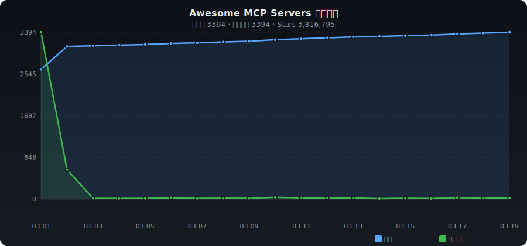

# ✨ Awesome MCP Servers

[English](./README.md) | **中文**

> Model Context Protocol (MCP) 服务器、客户端、SDK 精选集合 —— 自动收录整理

   

---

## 📈 收录趋势

<p align="center"></p>

---

## 📊 分类统计

| 分类 | 数量 | 占比 |
|------|-----:|-----:|
| 🏛️ 官方 & 参考实现 | 216 | ██ 6.6% |
| 🗄️ 数据库 | 114 | █ 3.5% |
| ☁️ 云服务 & 基础设施 | 150 | █ 4.6% |
| 🔧 开发工具 | 645 | ██████ 19.8% |
| 🔍 搜索 & 网页 | 290 | ██ 8.9% |
| 📁 文件系统 | 46 | █ 1.4% |
| 🤖 AI & 模型 | 1062 | ██████████ 32.6% |
| 💬 通讯 & 协作 | 8 | █ 0.2% |
| 📋 效率工具 | 26 | █ 0.8% |
| 📊 数据处理 | 63 | █ 1.9% |
| 🔐 安全 & 认证 | 51 | █ 1.6% |
| 📦 其他 | 590 | ██████ 18.1% |

---

## 🔥 每日热门 (2026-03-11)

| # | 项目 | ⭐ | 📈 日增 | 描述 |
|:-:|------|---:|-------:|------|
| 1 | [affaan-m/everything-claude-code](https://github.com/affaan-m/everything-claude-code) | 71,315 | +1497 | 该代理利用性能优化系统。为Claude Code、Codex、Cowork等提供技能、本能、记忆、安... |
| 2 | [D4Vinci/Scrapling](https://github.com/D4Vinci/Scrapling) | 28,409 | +596 | ️ 适应性Web Scraping框架,从一个请求到一个全规模的爬虫处理一切! |
| 3 | [farion1231/cc-switch](https://github.com/farion1231/cc-switch) | 26,645 | +463 | 一个跨平台桌面所有在一个助理工具,用于克劳德代码,Codex,OpenCode & Gemini C... |
| 4 | [ComposioHQ/awesome-claude-skills](https://github.com/ComposioHQ/awesome-claude-skills) | 42,972 | +435 | 精选的Claude技能、资源和工具列表，用于定制Claude AI工作流。 |
| 5 | [sickn33/antigravity-awesome-skills](https://github.com/sickn33/antigravity-awesome-skills) | 23,138 | +418 | 对于克劳德代码/反重力/课程的900多种代理技能的终极集合. |
| 6 | [AstrBotDevs/AstrBot](https://github.com/AstrBotDevs/AstrBot) | 20,762 | +335 | 通过集成大量的IM平台,LLM,插件和人工智能功能, |
| 7 | [Panniantong/Agent-Reach](https://github.com/Panniantong/Agent-Reach) | 8,301 | +320 | 让你的AI代理看到整个互联网.阅读和搜索Twitter,Reddit,YouTube,GitHub,... |
| 8 | [CodeGraphContext/CodeGraphContext](https://github.com/CodeGraphContext/CodeGraphContext) | 1,695 | +248 | An MCP server plus a CLI tool that indexes local c... |
| 9 | [sansan0/TrendRadar](https://github.com/sansan0/TrendRadar) | 48,598 | +218 | ⭐AI驱动的舆情与趋势监控，具备多平台聚合、RSS订阅和智能警报功能。🎯 告别信息过载，您的AI舆情... |
| 10 | [ruvnet/ruflo](https://github.com/ruvnet/ruflo) | 20,521 | +189 |  克劳德的领先代理配套平台.部署智能多代理群体,协调自主工作流程,构建对话式人工智能系统.具有企业级... |
| 11 | [n8n-io/n8n](https://github.com/n8n-io/n8n) | 178,660 | +187 | Fair-code workflow automation platform with native... |
| 12 | [DeusData/codebase-memory-mcp](https://github.com/DeusData/codebase-memory-mcp) | 562 | +180 | 让你在一个持续的知识图中索引你的代码基础. 35种语言,下-ms 查询,比 grep 减少了99%. |
| 13 | [ChromeDevTools/chrome-devtools-mcp](https://github.com/ChromeDevTools/chrome-devtools-mcp) | 28,476 | +160 | 编码代理的Chrome DevTools |
| 14 | [upstash/context7](https://github.com/upstash/context7) | 48,533 | +154 | Context7 MCP服务器——为LLMs和AI代码编辑器提供最新的代码文档 |
| 15 | [microsoft/azure-skills](https://github.com/microsoft/azure-skills) | 177 | +147 | 官方代理插件为Azure场景提供技能和MCP服务器配置. |
| 16 | [google-gemini/gemini-cli](https://github.com/google-gemini/gemini-cli) | 97,252 | +133 | An open-source AI agent that brings the power of G... |
| 17 | [superset-sh/superset](https://github.com/superset-sh/superset) | 6,568 | +132 | 智能化代理时代的IDE - 在机器上运行一个克劳德代码,Codex等的军队 |
| 18 | [anthropics/claude-plugins-official](https://github.com/anthropics/claude-plugins-official) | 9,764 | +131 | 官方,人类管理的高质量克劳德代码插件目录. |
| 19 | [modelcontextprotocol/servers](https://github.com/modelcontextprotocol/servers) | 80,812 | +116 | Model Context Protocol Servers |
| 20 | [AgriciDaniel/claude-seo](https://github.com/AgriciDaniel/claude-seo) | 2,045 | +107 | 对于克劳德代码的普遍SEO技能. 13个子技能, 6个子基,扩展系统与 DataForSEO MCP... |

---

## 📁 分类目录

- [🏛️ 官方 & 参考实现](#official) (216)
- [🗄️ 数据库](#database) (114)
- [☁️ 云服务 & 基础设施](#cloud) (150)
- [🔧 开发工具](#dev-tools) (645)
- [🔍 搜索 & 网页](#web-search) (290)
- [📁 文件系统](#file-system) (46)
- [🤖 AI & 模型](#ai-ml) (1062)
- [💬 通讯 & 协作](#communication) (8)
- [📋 效率工具](#productivity) (26)
- [📊 数据处理](#data) (63)
- [🔐 安全 & 认证](#security) (51)
- [📦 其他](#other) (590)

---

### <a id="official"></a>🏛️ 官方 & 参考实现

| 项目 | ⭐ | 语言 | 描述 |
|------|---:|:----:|------|
| [modelcontextprotocol/servers](https://github.com/modelcontextprotocol/servers) | 80,812 | TypeScript | Model Context Protocol Servers |
| [sickn33/antigravity-awesome-skills](https://github.com/sickn33/antigravity-awesome-skills) | 23,138 | Python | The Ultimate Collection of 900+ Agentic Skills for Claude Code/Antigra... |
| [modelcontextprotocol/python-sdk](https://github.com/modelcontextprotocol/python-sdk) | 22,091 | Python | The official Python SDK for Model Context Protocol servers and clients |
| [microsoft/mcp-for-beginners](https://github.com/microsoft/mcp-for-beginners) | 15,304 | Jupyter Notebook | This open-source curriculum introduces the fundamentals of Model Conte... |
| [modelcontextprotocol/typescript-sdk](https://github.com/modelcontextprotocol/typescript-sdk) | 11,814 | TypeScript | The official TypeScript SDK for Model Context Protocol servers and cli... |
| [creativetimofficial/ui](https://github.com/creativetimofficial/ui) | 11,755 | TypeScript | Open-source components, blocks, and AI agents designed to speed up you... |
| [anthropics/claude-plugins-official](https://github.com/anthropics/claude-plugins-official) | 9,764 | Python | Official, Anthropic-managed directory of high quality Claude Code Plug... |
| [mcp-use/mcp-use](https://github.com/mcp-use/mcp-use) | 9,419 | TypeScript | The fullstack MCP framework to develop MCP Apps for ChatGPT / Claude &... |
| [pietrozullo/mcp-use](https://github.com/mcp-use/mcp-use) | 9,344 | TypeScript | The fullstack MCP framework to develop MCP Apps for ChatGPT / Claude &... |
| [modelcontextprotocol/inspector](https://github.com/modelcontextprotocol/inspector) | 9,000 | TypeScript | Visual testing tool for MCP servers |
| [awslabs/mcp](https://github.com/awslabs/mcp) | 8,415 | Python | Official MCP Servers for AWS |
| [modelcontextprotocol/modelcontextprotocol](https://github.com/modelcontextprotocol/modelcontextprotocol) | 7,454 | TypeScript | Specification and documentation for the Model Context Protocol |
| [modelcontextprotocol/registry](https://github.com/modelcontextprotocol/registry) | 6,545 | Go | A community driven registry service for Model Context Protocol (MCP) s... |
| [mrexodia/ida-pro-mcp](https://github.com/mrexodia/ida-pro-mcp) | 6,268 | Python | AI-powered reverse engineering assistant that bridges IDA Pro with lan... |
| [modelcontextprotocol/go-sdk](https://github.com/modelcontextprotocol/go-sdk) | 4,088 | Go | The official Go SDK for Model Context Protocol servers and clients. Ma... |
| [modelcontextprotocol/csharp-sdk](https://github.com/modelcontextprotocol/csharp-sdk) | 4,059 | C# | The official C# SDK for Model Context Protocol servers and clients. Ma... |
| [makenotion/notion-mcp-server](https://github.com/makenotion/notion-mcp-server) | 4,019 | TypeScript | Official Notion MCP Server |
| [Pimzino/spec-workflow-mcp](https://github.com/Pimzino/spec-workflow-mcp) | 3,981 | TypeScript | A Model Context Protocol (MCP) server that provides structured spec-dr... |
| [makenotion/notion-mcp](https://github.com/makenotion/notion-mcp-server) | 3,964 | TypeScript | Official Notion MCP Server |
| [liaokongVFX/MCP-Chinese-Getting-Started-Guide](https://github.com/liaokongVFX/MCP-Chinese-Getting-Started-Guide) | 3,369 | - | Model Context Protocol(MCP) 编程极速入门 |
| [modelcontextprotocol/java-sdk](https://github.com/modelcontextprotocol/java-sdk) | 3,248 | Java | The official Java SDK for Model Context Protocol servers and clients. ... |
| [metorial/metorial](https://github.com/metorial/metorial) | 3,226 | TypeScript | Connect any AI model to 600+ integrations; powered by MCP 📡 🚀 |
| [huangjunsen0406/py-xiaozhi](https://github.com/huangjunsen0406/py-xiaozhi) | 3,212 | Python | A Python-based Xiaozhi AI for users who want the full Xiaozhi experien... |
| [modelcontextprotocol/rust-sdk](https://github.com/modelcontextprotocol/rust-sdk) | 3,141 | Rust | The official Rust SDK for the Model Context Protocol |
| [supermemoryai/apple-mcp](https://github.com/supermemoryai/apple-mcp) | 3,027 | TypeScript | Collection of apple-native tools for the model context protocol. |
| [microsoft/mcp](https://github.com/microsoft/mcp) | 2,755 | C# | Catalog of official Microsoft MCP (Model Context Protocol) server impl... |
| [perplexityai/modelcontextprotocol](https://github.com/perplexityai/modelcontextprotocol) | 2,003 | TypeScript | The official MCP server implementation for the Perplexity API Platform |
| [ppl-ai/modelcontextprotocol](https://github.com/perplexityai/modelcontextprotocol) | 1,989 | TypeScript | The official MCP server implementation for the Perplexity API Platform |
| [snyk/agent-scan](https://github.com/snyk/agent-scan) | 1,833 | Python | Security scanner for AI agents, MCP servers and agent skills. |
| [modelcontextprotocol/ext-apps](https://github.com/modelcontextprotocol/ext-apps) | 1,808 | TypeScript | Official repo for spec & SDK of MCP Apps protocol - standard for UIs e... |
| [modelcontextprotocol/mcpb](https://github.com/modelcontextprotocol/mcpb) | 1,764 | TypeScript | Desktop Extensions: One-click local MCP server installation in desktop... |
| [minecraft-dev/MinecraftDev](https://github.com/minecraft-dev/MinecraftDev) | 1,719 | Kotlin | Plugin for IntelliJ IDEA that gives special support for Minecraft modd... |
| [chongdashu/unreal-mcp](https://github.com/chongdashu/unreal-mcp) | 1,545 | C++ | Enable AI assistant clients like Cursor, Windsurf and Claude Desktop t... |
| [f/mcptools](https://github.com/f/mcptools) | 1,513 | Go | A command-line interface for interacting with MCP (Model Context Proto... |
| [isaacphi/mcp-language-server](https://github.com/isaacphi/mcp-language-server) | 1,475 | Go | mcp-language-server gives MCP enabled clients access semantic tools li... |
| [ForLoopCodes/contextplus](https://github.com/ForLoopCodes/contextplus) | 1,450 | TypeScript | Semantic Intelligence for Large-Scale Engineering. Context+ is an MCP ... |
| [modelcontextprotocol/php-sdk](https://github.com/modelcontextprotocol/php-sdk) | 1,402 | PHP | The official PHP SDK for Model Context Protocol servers and clients. M... |
| [MiniMax-AI/MiniMax-MCP](https://github.com/MiniMax-AI/MiniMax-MCP) | 1,303 | Python | Official MiniMax Model Context Protocol (MCP) server that enables inte... |
| [modelcontextprotocol/swift-sdk](https://github.com/modelcontextprotocol/swift-sdk) | 1,298 | Swift | The official Swift SDK for Model Context Protocol servers and clients. |
| [modelcontextprotocol/kotlin-sdk](https://github.com/modelcontextprotocol/kotlin-sdk) | 1,287 | Kotlin | The official Kotlin SDK for Model Context Protocol servers and clients... |

---

### <a id="database"></a>🗄️ 数据库

| 项目 | ⭐ | 语言 | 描述 |
|------|---:|:----:|------|
| [netdata/netdata](https://github.com/netdata/netdata) | 77,919 | C | The fastest path to AI-powered full stack observability, even for lean... |
| [mindsdb/mindsdb](https://github.com/mindsdb/mindsdb) | 38,602 | Python | Query Engine for AI Analytics: Build self-reasoning agents across all ... |
| [googleapis/genai-toolbox](https://github.com/googleapis/genai-toolbox) | 13,368 | Go | MCP Toolbox for Databases is an open source MCP server for databases. |
| [JoeanAmier/XHS-Downloader](https://github.com/JoeanAmier/XHS-Downloader) | 10,331 | Python | 小红书（XiaoHongShu、RedNote）链接提取/作品采集工具：提取账号发布、收藏、点赞、专辑作品链接；提取搜索结果作品、用户链接；... |
| [tobymao/sqlglot](https://github.com/tobymao/sqlglot) | 8,971 | Python | Python SQL Parser and Transpiler |
| [panaversity/learn-agentic-ai](https://github.com/panaversity/learn-agentic-ai) | 3,957 | Jupyter Notebook | Learn Agentic AI using Dapr Agentic Cloud Ascent (DACA) Design Pattern... |
| [supabase-community/supabase-mcp](https://github.com/supabase-community/supabase-mcp) | 2,497 | TypeScript | Connect Supabase to your AI assistants |
| [bytebase/dbhub](https://github.com/bytebase/dbhub) | 2,281 | TypeScript | Zero-dependency, token-efficient database MCP server for Postgres, MyS... |
| [crystaldba/postgres-mcp](https://github.com/crystaldba/postgres-mcp) | 2,216 | Python | Postgres MCP Pro provides configurable read/write access and performan... |
| [timescale/pg-aiguide](https://github.com/timescale/pg-aiguide) | 1,602 | Python | MCP server and Claude plugin for Postgres skills and documentation. He... |
| [doobidoo/mcp-memory-service](https://github.com/doobidoo/mcp-memory-service) | 1,503 | Python | Open-source persistent memory for AI agent pipelines (LangGraph, CrewA... |
| [benborla/mcp-server-mysql](https://github.com/benborla/mcp-server-mysql) | 1,323 | JavaScript | A Model Context Protocol server that provides read-only access to MySQ... |
| [designcomputer/mysql_mcp_server](https://github.com/designcomputer/mysql_mcp_server) | 1,154 | Python | A Model Context Protocol (MCP) server that enables secure interaction ... |
| [sheshbabu/zen](https://github.com/sheshbabu/zen) | 1,060 | JavaScript | Selfhosted notes app. Single golang binary, notes stored as markdown w... |
| [Gentleman-Programming/engram](https://github.com/Gentleman-Programming/engram) | 988 | Go | Persistent memory system for AI coding agents. Agent-agnostic Go binar... |
| [mongodb-js/mongodb-mcp-server](https://github.com/mongodb-js/mongodb-mcp-server) | 951 | TypeScript | A Model Context Protocol server to connect to MongoDB databases and Mo... |
| [neo4j-contrib/mcp-neo4j](https://github.com/neo4j-contrib/mcp-neo4j) | 912 | Python | Neo4j Labs Model Context Protocol servers |
| [alexander-zuev/supabase-mcp-server](https://github.com/alexander-zuev/supabase-mcp-server) | 814 | Python | Query MCP enables end-to-end management of Supabase via chat interface... |
| [ClickHouse/mcp-clickhouse](https://github.com/ClickHouse/mcp-clickhouse) | 699 | Python | Connect ClickHouse to your AI assistants. |
| [debba/tabularis](https://github.com/debba/tabularis) | 661 | TypeScript | A lightweight, developer-focused database management tool. Supports My... |
| [saidsurucu/yargi-mcp](https://github.com/saidsurucu/yargi-mcp) | 660 | Python | MCP Server For Turkish Legal Databases |
| [elastic/mcp-server-elasticsearch](https://github.com/elastic/mcp-server-elasticsearch) | 617 | Rust |  |
| [Dataojitori/nocturne_memory](https://github.com/Dataojitori/nocturne_memory) | 612 | Python | 一个基于uri而不是RAG的轻量级、可回滚、可视化的 **AI 外挂MCP记忆库**。让你的 AI 拥有跨模型，跨会话，跨工具的持久的结构化... |
| [Anarkh-Lee/universal-db-mcp](https://github.com/Anarkh-Lee/universal-db-mcp) | 605 | TypeScript | 通用数据库 MCP 连接器：支持 MySQL、PostgreSQL、Oracle、MongoDB 等 17 种数据库，支持 Claude D... |
| [DeusData/codebase-memory-mcp](https://github.com/DeusData/codebase-memory-mcp) | 562 | Go | MCP server that indexes your codebase into a persistent knowledge grap... |
| [cyproxio/mcp-for-security](https://github.com/cyproxio/mcp-for-security) | 558 | TypeScript | MCP for Security: A collection of Model Context Protocol servers for p... |
| [neondatabase/mcp-server-neon](https://github.com/neondatabase/mcp-server-neon) | 557 | TypeScript | MCP server for interacting with Neon Management API and databases |
| [NicholasGoh/fastapi-mcp-langgraph-template](https://github.com/NicholasGoh/fastapi-mcp-langgraph-template) | 536 | Python | A modern template for agentic orchestration — built for rapid iteratio... |
| [subnetmarco/pgmcp](https://github.com/subnetmarco/pgmcp) | 524 | Go | An MCP server to query any Postgres database in natural language. |
| [centralmind/gateway](https://github.com/centralmind/gateway) | 517 | Go | Universal MCP-Server for your Databases optimized for LLMs and AI-Agen... |
| [chroma-core/chroma-mcp](https://github.com/chroma-core/chroma-mcp) | 512 | Python | A Model Context Protocol (MCP) server implementation that provides dat... |
| [agentic-community/mcp-gateway-registry](https://github.com/agentic-community/mcp-gateway-registry) | 479 | Python | Enterprise-ready MCP Gateway & Registry that centralizes AI developmen... |
| [cyanheads/atlas-mcp-server](https://github.com/cyanheads/atlas-mcp-server) | 467 | TypeScript | A Model Context Protocol (MCP) server for ATLAS, a Neo4j-powered task ... |
| [redis/mcp-redis](https://github.com/redis/mcp-redis) | 434 | Python | The official Redis MCP Server is a natural language interface designed... |
| [tx7do/kratos-transport](https://github.com/tx7do/kratos-transport) | 427 | Go | kratos transport layer extension, support: rabbitmq,kafka,rocketmq,act... |
| [samvallad33/vestige](https://github.com/samvallad33/vestige) | 416 | Rust | Cognitive memory for AI agents — FSRS-6 spaced repetition, 29 brain mo... |
| [gannonh/memento-mcp](https://github.com/gannonh/memento-mcp) | 409 | TypeScript | Memento MCP: A Knowledge Graph Memory System for LLMs |
| [runekaagaard/mcp-alchemy](https://github.com/runekaagaard/mcp-alchemy) | 396 | Python | A MCP (model context protocol) server that gives the LLM access to and... |
| [awslabs/graphrag-toolkit](https://github.com/awslabs/graphrag-toolkit) | 365 | Python | Python toolkit for building graph-enhanced GenAI applications |
| [FreePeak/db-mcp-server](https://github.com/FreePeak/db-mcp-server) | 351 | Go | A powerful multi-database server implementing the Model Context Protoc... |

---

### <a id="cloud"></a>☁️ 云服务 & 基础设施

| 项目 | ⭐ | 语言 | 描述 |
|------|---:|:----:|------|
| [n8n-io/n8n](https://github.com/n8n-io/n8n) | 178,660 | TypeScript | Fair-code workflow automation platform with native AI capabilities. Co... |
| [Kong/kong](https://github.com/Kong/kong) | 42,923 | Lua | 🦍 The API and AI Gateway |
| [apache/apisix](https://github.com/apache/apisix) | 16,257 | Lua | The Cloud-Native API Gateway and AI Gateway |
| [triggerdotdev/trigger.dev](https://github.com/triggerdotdev/trigger.dev) | 13,991 | TypeScript | Trigger.dev – build and deploy fully‑managed AI agents and workflows |
| [cert-manager/cert-manager](https://github.com/cert-manager/cert-manager) | 13,635 | Go | Automatically provision and manage TLS certificates in Kubernetes |
| [0xJacky/nginx-ui](https://github.com/0xJacky/nginx-ui) | 10,815 | Go | Yet another WebUI for Nginx |
| [microsandbox/microsandbox](https://github.com/zerocore-ai/microsandbox) | 4,889 | Rust | opensource self-hosted sandboxes for ai agents |
| [txn2/kubefwd](https://github.com/txn2/kubefwd) | 4,065 | Go | Bulk port forwarding Kubernetes services for local development. |
| [cloudflare/mcp-server-cloudflare](https://github.com/cloudflare/mcp-server-cloudflare) | 3,522 | TypeScript |  |
| [octelium/octelium](https://github.com/octelium/octelium) | 3,474 | Go | A next-gen FOSS self-hosted unified zero trust secure access platform ... |
| [IBM/mcp-context-forge](https://github.com/IBM/mcp-context-forge) | 3,391 | Python | An AI Gateway, registry, and proxy that sits in front of any MCP, A2A,... |
| [metatool-ai/metamcp](https://github.com/metatool-ai/metamcp) | 2,099 | TypeScript | MCP Aggregator, Orchestrator, Middleware, Gateway in one docker |
| [metatool-ai/metatool-app](https://github.com/metatool-ai/metamcp) | 2,059 | TypeScript | MCP Aggregator, Orchestrator, Middleware, Gateway in one docker |
| [AmoyLab/Unla](https://github.com/AmoyLab/Unla) | 2,049 | TypeScript | 🧩 MCP Gateway - A lightweight gateway service that instantly transform... |
| [amoylab/unla](https://github.com/AmoyLab/Unla) | 2,042 | TypeScript | 🧩 MCP Gateway - A lightweight gateway service that instantly transform... |
| [agentgateway/agentgateway](https://github.com/agentgateway/agentgateway) | 1,904 | Rust | Next Generation Agentic Proxy for AI Agents and MCP servers |
| [yomorun/yomo](https://github.com/yomorun/yomo) | 1,887 | Go | 🦖 Serverless AI Agent Framework with Geo-distributed Edge AI Infra. |
| [microsoft/skills](https://github.com/microsoft/skills) | 1,690 | TypeScript | Skills, MCP servers, Custom Agents, Agents.md for SDKs to ground Codin... |
| [stacklok/toolhive](https://github.com/stacklok/toolhive) | 1,647 | Go | ToolHive makes deploying MCP servers easy, secure and fun |
| [StacklokLabs/toolhive](https://github.com/stacklok/toolhive) | 1,623 | Go | ToolHive makes deploying MCP servers easy, secure and fun |
| [Stacklok/toolhive](https://github.com/stacklok/toolhive) | 1,623 | Go | ToolHive makes deploying MCP servers easy, secure and fun |
| [microsoft/azure-devops-mcp](https://github.com/microsoft/azure-devops-mcp) | 1,390 | TypeScript | The MCP server for Azure DevOps, bringing the power of Azure DevOps di... |
| [theNetworkChuck/docker-mcp-tutorial](https://github.com/theNetworkChuck/docker-mcp-tutorial) | 1,389 | - | Complete tutorial materials for building MCP servers with Docker - fro... |
| [Flux159/mcp-server-kubernetes](https://github.com/Flux159/mcp-server-kubernetes) | 1,344 | TypeScript | MCP Server for kubernetes management commands |
| [hashicorp/terraform-mcp-server](https://github.com/hashicorp/terraform-mcp-server) | 1,269 | Go | The Terraform MCP Server provides seamless integration with Terraform ... |
| [Azure/azure-mcp](https://github.com/Azure/azure-mcp) | 1,209 | C# | The Azure MCP Server, bringing the power of Azure to your agents. |
| [iannuttall/mcp-boilerplate](https://github.com/iannuttall/mcp-boilerplate) | 1,015 | TypeScript | A remote Cloudflare MCP server boilerplate with user authentication an... |
| [openops-cloud/openops](https://github.com/openops-cloud/openops) | 1,003 | TypeScript | The batteries-included, No-Code FinOps automation platform, with the A... |
| [TencentCloudBase/CloudBase-MCP](https://github.com/TencentCloudBase/CloudBase-MCP) | 972 | TypeScript | CloudBase MCP - Connect CloudBase to your AI Agent.     Go from AI pro... |
| [TencentCloudBase/CloudBase-AI-ToolKit](https://github.com/TencentCloudBase/CloudBase-MCP) | 963 | TypeScript | CloudBase MCP - Connect CloudBase to your AI Agent.     Go from AI pro... |
| [googleapis/gcloud-mcp](https://github.com/googleapis/gcloud-mcp) | 703 | TypeScript | gcloud MCP server |
| [ckreiling/mcp-server-docker](https://github.com/ckreiling/mcp-server-docker) | 687 | Python | MCP server for Docker |
| [vercel/next-devtools-mcp](https://github.com/vercel/next-devtools-mcp) | 655 | TypeScript | Next.js Development for Coding Agent |
| [cloudflare/workers-mcp](https://github.com/cloudflare/workers-mcp) | 626 | TypeScript | Talk to a Cloudflare Worker from Claude Desktop! |
| [agentscope-ai/agentscope-runtime](https://github.com/agentscope-ai/agentscope-runtime) | 572 | Python | A production-ready runtime framework for agent apps with secure tool s... |
| [GoogleCloudPlatform/cloud-run-mcp](https://github.com/GoogleCloudPlatform/cloud-run-mcp) | 545 | JavaScript | MCP server to deploy apps to Cloud Run |
| [microsoft/mcp-gateway](https://github.com/microsoft/mcp-gateway) | 517 | C# | MCP Gateway is a reverse proxy and management layer for MCP servers, e... |
| [ridafkih/keeper.sh](https://github.com/ridafkih/keeper.sh) | 412 | TypeScript | Open-source calendar sync tool. Aggregate events from Google, Outlook,... |
| [docker/labs-ai-tools-for-devs](https://github.com/docker/labs-ai-tools-for-devs) | 379 | Clojure | Your trusted home for discovering MCP tools – seamlessly integrated in... |
| [strowk/mcp-k8s-go](https://github.com/strowk/mcp-k8s-go) | 375 | Go | MCP server connecting to Kubernetes |

---

### <a id="dev-tools"></a>🔧 开发工具

| 项目 | ⭐ | 语言 | 描述 |
|------|---:|:----:|------|
| [google-gemini/gemini-cli](https://github.com/google-gemini/gemini-cli) | 97,252 | TypeScript | An open-source AI agent that brings the power of Gemini directly into ... |
| [ComposioHQ/awesome-claude-skills](https://github.com/ComposioHQ/awesome-claude-skills) | 42,972 | Python | A curated list of awesome Claude Skills, resources, and tools for cust... |
| [github/github-mcp-server](https://github.com/github/github-mcp-server) | 27,757 | Go | GitHub's official MCP Server |
| [farion1231/cc-switch](https://github.com/farion1231/cc-switch) | 26,645 | TypeScript | A cross-platform desktop All-in-One assistant tool for Claude Code, Co... |
| [PrefectHQ/fastmcp](https://github.com/PrefectHQ/fastmcp) | 23,581 | Python | 🚀 The fast, Pythonic way to build MCP servers and clients. |
| [jlowin/fastmcp](https://github.com/PrefectHQ/fastmcp) | 23,286 | Python | 🚀 The fast, Pythonic way to build MCP servers and clients. |
| [cyclotruc/gitingest](https://github.com/coderamp-labs/gitingest) | 14,048 | Python | Replace 'hub' with 'ingest' in any GitHub URL to get a prompt-friendly... |
| [electerm/electerm](https://github.com/electerm/electerm) | 13,707 | JavaScript | 📻Terminal/ssh/sftp/ftp/telnet/serialport/RDP/VNC/Spice client(linux, m... |
| [yusufkaraaslan/Skill_Seekers](https://github.com/yusufkaraaslan/Skill_Seekers) | 10,662 | Python | Convert documentation websites, GitHub repositories, and PDFs into Cla... |
| [Panniantong/Agent-Reach](https://github.com/Panniantong/Agent-Reach) | 8,301 | Python | Give your AI agent eyes to see the entire internet. Read & search Twit... |
| [idosal/git-mcp](https://github.com/idosal/git-mcp) | 7,741 | TypeScript | Put an end to code hallucinations! GitMCP is a free, open-source, remo... |
| [firerpa/lamda](https://github.com/firerpa/lamda) | 7,658 | Python | The most powerful Android RPA agent framework, next generation of mobi... |
| [0x4m4/hexstrike-ai](https://github.com/0x4m4/hexstrike-ai) | 7,376 | Python | HexStrike AI MCP Agents is an advanced MCP server that lets AI agents ... |
| [superset-sh/superset](https://github.com/superset-sh/superset) | 6,568 | TypeScript | IDE for the AI Agents Era - Run an army of Claude Code, Codex, etc. on... |
| [yzfly/Awesome-MCP-ZH](https://github.com/yzfly/Awesome-MCP-ZH) | 6,450 | - | MCP 资源精选， MCP指南，Claude MCP，MCP Servers, MCP Clients |
| [punkpeye/awesome-mcp-clients](https://github.com/punkpeye/awesome-mcp-clients) | 6,337 | - | A collection of MCP clients. |
| [wonderwhy-er/DesktopCommanderMCP](https://github.com/wonderwhy-er/DesktopCommanderMCP) | 5,654 | TypeScript | This is MCP server for Claude that gives it terminal control, file sys... |
| [getsentry/XcodeBuildMCP](https://github.com/getsentry/XcodeBuildMCP) | 4,677 | TypeScript | A Model Context Protocol (MCP) server and CLI that provides tools for ... |
| [sooperset/mcp-atlassian](https://github.com/sooperset/mcp-atlassian) | 4,571 | Python | MCP server for Atlassian tools (Confluence, Jira) |
| [cameroncooke/xcodebuildmcp](https://github.com/getsentry/XcodeBuildMCP) | 4,523 | TypeScript | A Model Context Protocol (MCP) server and CLI that provides tools for ... |
| [21st-dev/magic-mcp](https://github.com/21st-dev/magic-mcp) | 4,399 | TypeScript | It's like v0 but in your Cursor/WindSurf/Cline. 21st dev Magic MCP ser... |
| [httprunner/httprunner](https://github.com/httprunner/httprunner) | 4,265 | Go | HttpRunner 是一款开源的 API/UI 测试框架，简单易用，功能强大，具有丰富的插件化机制和高度的可扩展能力。 |
| [opensumi/core](https://github.com/opensumi/core) | 3,607 | TypeScript | A framework helps you quickly build AI Native IDE products. MCP Client... |
| [parcadei/Continuous-Claude-v3](https://github.com/parcadei/Continuous-Claude-v3) | 3,600 | Python | Context management for Claude Code. Hooks maintain state via ledgers a... |
| [campfirein/cipher](https://github.com/campfirein/cipher) | 3,568 | TypeScript | Byterover Cipher is an opensource memory layer specifically designed f... |
| [joreilly/PeopleInSpace](https://github.com/joreilly/PeopleInSpace) | 3,309 | Kotlin | Kotlin Multiplatform sample with SwiftUI, Jetpack Compose, Compose for... |
| [agent-infra/sandbox](https://github.com/agent-infra/sandbox) | 2,974 | Python | All-in-One Sandbox for AI Agents that combines Browser, Shell, File, M... |
| [SamurAIGPT/Generative-Media-Skills](https://github.com/SamurAIGPT/Generative-Media-Skills) | 2,882 | Shell | Multi-modal Generative Media Skills for AI Agents (Claude Code, Cursor... |
| [maximhq/bifrost](https://github.com/maximhq/bifrost) | 2,838 | Go | Fastest enterprise AI gateway (50x faster than LiteLLM) with adaptive ... |
| [haydenbleasel/ultracite](https://github.com/haydenbleasel/ultracite) | 2,736 | TypeScript | A highly opinionated, zero-configuration linter and formatter. |
| [Ed1s0nZ/CyberStrikeAI](https://github.com/Ed1s0nZ/CyberStrikeAI) | 2,724 | Go | CyberStrikeAI is an AI-native security testing platform built in Go. I... |
| [steipete/Peekaboo](https://github.com/steipete/Peekaboo) | 2,681 | Swift | Peekaboo is a macOS CLI & optional MCP server that enables AI agents t... |
| [davepoon/buildwithclaude](https://github.com/davepoon/buildwithclaude) | 2,567 | TypeScript | A single hub to find Claude Skills, Agents, Commands, Hooks, Plugins, ... |
| [go-nunu/nunu](https://github.com/go-nunu/nunu) | 2,551 | Go | A CLI tool for building Go applications. |
| [av/harbor](https://github.com/av/harbor) | 2,491 | TypeScript | One command brings a complete pre-wired LLM stack with hundreds of ser... |
| [Coding-Solo/godot-mcp](https://github.com/Coding-Solo/godot-mcp) | 2,275 | JavaScript | MCP server for interfacing with Godot game engine. Provides tools for ... |
| [daodao97/chatmcp](https://github.com/daodao97/chatmcp) | 2,183 | Dart | ChatMCP is an AI chat client implementing the Model Context Protocol (... |
| [jamubc/gemini-mcp-tool](https://github.com/jamubc/gemini-mcp-tool) | 2,052 | TypeScript | MCP server that enables AI assistants to interact with Google Gemini C... |
| [chrishayuk/mcp-cli](https://github.com/IBM/mcp-cli) | 1,896 | Python |  |
| [mcp-router/mcp-router](https://github.com/mcp-router/mcp-router) | 1,834 | TypeScript | A Unified MCP Server Management App (MCP Manager). |

---

### <a id="web-search"></a>🔍 搜索 & 网页

| 项目 | ⭐ | 语言 | 描述 |
|------|---:|:----:|------|
| [bytedance/UI-TARS-desktop](https://github.com/bytedance/UI-TARS-desktop) | 28,722 | TypeScript | The Open-Source Multimodal AI Agent Stack: Connecting Cutting-Edge AI ... |
| [microsoft/playwright-mcp](https://github.com/microsoft/playwright-mcp) | 28,648 | TypeScript | Playwright MCP server |
| [ChromeDevTools/chrome-devtools-mcp](https://github.com/ChromeDevTools/chrome-devtools-mcp) | 28,476 | TypeScript | Chrome DevTools for coding agents |
| [D4Vinci/Scrapling](https://github.com/D4Vinci/Scrapling) | 28,409 | Python | 🕷️ An adaptive Web Scraping framework that handles everything from a s... |
| [assafelovic/gpt-researcher](https://github.com/assafelovic/gpt-researcher) | 25,657 | Python | An autonomous agent that conducts deep research on any data using any ... |
| [casdoor/casdoor](https://github.com/casdoor/casdoor) | 13,134 | Go | An open-source AI-first Identity and Access Management (IAM) /AI MCP g... |
| [hangwin/mcp-chrome](https://github.com/hangwin/mcp-chrome) | 10,715 | TypeScript | Chrome MCP Server is a Chrome extension-based Model Context Protocol (... |
| [BrowserMCP/mcp](https://github.com/BrowserMCP/mcp) | 6,022 | TypeScript | Browser MCP is a Model Context Provider (MCP) server that allows AI ap... |
| [browsermcp/mcp](https://github.com/BrowserMCP/mcp) | 5,901 | TypeScript | Browser MCP is a Model Context Provider (MCP) server that allows AI ap... |
| [firecrawl/firecrawl-mcp-server](https://github.com/firecrawl/firecrawl-mcp-server) | 5,735 | JavaScript | 🔥 Official Firecrawl MCP Server - Adds powerful web scraping and searc... |
| [mendableai/firecrawl-mcp-server](https://github.com/firecrawl/firecrawl-mcp-server) | 5,632 | JavaScript | 🔥 Official Firecrawl MCP Server - Adds powerful web scraping and searc... |
| [executeautomation/mcp-playwright](https://github.com/executeautomation/mcp-playwright) | 5,300 | TypeScript | Playwright Model Context Protocol Server - Tool to automate Browsers a... |
| [open-webui/mcpo](https://github.com/open-webui/mcpo) | 4,041 | Python | A simple, secure MCP-to-OpenAPI proxy server |
| [exa-labs/exa-mcp-server](https://github.com/exa-labs/exa-mcp-server) | 3,982 | TypeScript | Exa MCP for web search and web crawling! |
| [Atmosphere/atmosphere](https://github.com/Atmosphere/atmosphere) | 3,745 | Java | The transport-agnostic real-time framework for the JVM. WebSocket, SSE... |
| [Minidoracat/mcp-feedback-enhanced](https://github.com/Minidoracat/mcp-feedback-enhanced) | 3,606 | JavaScript | Enhanced MCP server for interactive user feedback and command executio... |
| [browserbase/mcp-server-browserbase](https://github.com/browserbase/mcp-server-browserbase) | 3,187 | TypeScript | Allow LLMs to control a browser with Browserbase and Stagehand |
| [blazickjp/arxiv-mcp-server](https://github.com/blazickjp/arxiv-mcp-server) | 2,320 | Python | A Model Context Protocol server for searching and analyzing arXiv pape... |
| [srbhptl39/MCP-SuperAssistant](https://github.com/srbhptl39/MCP-SuperAssistant) | 2,313 | TypeScript | Brings MCP to ChatGPT, DeepSeek, Perplexity, Grok, Gemini, Google AI S... |
| [deedy5/ddgs](https://github.com/deedy5/ddgs) | 2,290 | Python | A metasearch library that aggregates results from diverse web search s... |
| [brightdata/brightdata-mcp](https://github.com/brightdata/brightdata-mcp) | 2,184 | JavaScript | A powerful Model Context Protocol (MCP) server that provides an all-in... |
| [papersgpt/papersgpt-for-zotero](https://github.com/papersgpt/papersgpt-for-zotero) | 2,163 | JavaScript | A powerful Zotero AI and MCP plugin with ChatGPT, Gemini 3.1, Claude, ... |
| [luminati-io/brightdata-mcp](https://github.com/brightdata/brightdata-mcp) | 2,131 | JavaScript | A powerful Model Context Protocol (MCP) server that provides an all-in... |
| [AgriciDaniel/claude-seo](https://github.com/AgriciDaniel/claude-seo) | 2,045 | Python | Universal SEO skill for Claude Code. 13 sub-skills, 6 subagents, exten... |
| [cyberagiinc/DevDocs](https://github.com/cyberagiinc/DevDocs) | 2,037 | TypeScript | Completely free, private, UI based Tech Documentation MCP server. Desi... |
| [Vexa-ai/vexa](https://github.com/Vexa-ai/vexa) | 1,792 | Python | Open-source meeting transcription API for Google Meet, Microsoft Teams... |
| [taylorwilsdon/google_workspace_mcp](https://github.com/taylorwilsdon/google_workspace_mcp) | 1,764 | Python | Control Gmail, Google Calendar, Docs, Sheets, Slides, Chat, Forms, Tas... |
| [korotovsky/slack-mcp-server](https://github.com/korotovsky/slack-mcp-server) | 1,437 | Go | The most powerful MCP Slack Server with no permission requirements, Ap... |
| [tavily-ai/tavily-mcp](https://github.com/tavily-ai/tavily-mcp) | 1,352 | JavaScript | Production ready MCP server with real-time search, extract, map & craw... |
| [smithery-ai/mcp-obsidian](https://github.com/smithery-ai/mcp-obsidian) | 1,331 | JavaScript | A connector for Claude Desktop to read and search an Obsidian vault. |
| [calclavia/mcp-obsidian](https://github.com/smithery-ai/mcp-obsidian) | 1,317 | JavaScript | A connector for Claude Desktop to read and search an Obsidian vault. |
| [grafbase/grafbase](https://github.com/grafbase/grafbase) | 1,220 | Rust | The Grafbase GraphQL Federation Gateway |
| [Devin-AXIS/A2V](https://github.com/Devin-AXIS/A2V) | 1,201 | TypeScript | A2V: Next-Gen AI Value Compute Protocol. |
| [wbopan/cui](https://github.com/wbopan/cui) | 1,142 | TypeScript | A web UI for Claude Code agents |
| [llmsresearch/paperbanana](https://github.com/llmsresearch/paperbanana) | 1,140 | Python | Open source implementation and extension of Google Research’s PaperBan... |
| [kimsungwhee/apple-docs-mcp](https://github.com/kimsungwhee/apple-docs-mcp) | 1,133 | TypeScript | MCP server for Apple Developer Documentation - Search iOS/macOS/SwiftU... |
| [stickerdaniel/linkedin-mcp-server](https://github.com/stickerdaniel/linkedin-mcp-server) | 1,024 | Python | This MCP server allows Claude and other AI assistants to access your L... |
| [jae-jae/fetcher-mcp](https://github.com/jae-jae/fetcher-mcp) | 1,007 | TypeScript | MCP server for fetch web page content using Playwright headless browse... |
| [JetBrains/mcpProxy](https://github.com/JetBrains/mcp-jetbrains) | 943 | JavaScript | A model context protocol server to work with JetBrains IDEs: IntelliJ,... |
| [JetBrains/mcp-jetbrains](https://github.com/JetBrains/mcp-jetbrains) | 942 | JavaScript | A model context protocol server to work with JetBrains IDEs: IntelliJ,... |

---

### <a id="file-system"></a>📁 文件系统

| 项目 | ⭐ | 语言 | 描述 |
|------|---:|:----:|------|
| [mickael-kerjean/filestash](https://github.com/mickael-kerjean/filestash) | 13,684 | JavaScript | :file_folder: File Management Platform / Universal Data Access Layer (... |
| [rusq/slackdump](https://github.com/rusq/slackdump) | 2,465 | Go | Save or export your private and public Slack messages, threads, files,... |
| [chatmcp/mcpso](https://github.com/chatmcp/mcpso) | 1,979 | TypeScript | directory for Awesome MCP Servers |
| [featureform/enrichmcp](https://github.com/featureform/enrichmcp) | 643 | Python | EnrichMCP is a python framework for building data driven MCP servers |
| [mark3labs/mcp-filesystem-server](https://github.com/mark3labs/mcp-filesystem-server) | 615 | Go | Go server implementing Model Context Protocol (MCP) for filesystem ope... |
| [evalstate/mcp-hfspace](https://github.com/evalstate/mcp-hfspace) | 382 | TypeScript | MCP Server to Use HuggingFace spaces, easy configuration and Claude De... |
| [MorDavid/BloodHound-MCP-AI](https://github.com/MorDavid/BloodHound-MCP-AI) | 341 | Python | BloodHound-MCP-AI is integration that connects BloodHound with AI thro... |
| [admica/FileScopeMCP](https://github.com/admica/FileScopeMCP) | 281 | HTML | Analyzes your codebase identifying important files based on dependency... |
| [8b-is/smart-tree](https://github.com/8b-is/smart-tree) | 227 | Rust | Smart Tree: not just a tree, a philosophy. A context-aware, AI-crafted... |
| [cnych/seo-mcp](https://github.com/cnych/seo-mcp) | 224 | Python | A free SEO tool MCP (Model Control Protocol) service based on Ahrefs d... |
| [jbeno/cursor-notebook-mcp](https://github.com/jbeno/cursor-notebook-mcp) | 152 | Python | Model Context Protocol (MCP) server designed to allow AI agents within... |
| [horw/esp-mcp](https://github.com/horw/esp-mcp) | 135 | Python | Centralize ESP32 related commands and simplify getting started with se... |
| [answerlink/MCP-Workspace-Server](https://github.com/answerlink/MCP-Workspace-Server) | 123 | Python | 🚀 Beyond Filesystem - Complete AI Development Environment - One MCP Se... |
| [TrNgTien/vfs](https://github.com/TrNgTien/vfs) | 102 | Go | Reduce AI agent token usage by 98% via Virtual Function Signatures. MC... |
| [KorigamiK/markitdown_mcp_server](https://github.com/KorigamiK/markitdown_mcp_server) | 69 | Python | A Model Context Protocol (MCP) server that converts various file forma... |
| [piotr-agier/google-drive-mcp](https://github.com/piotr-agier/google-drive-mcp) | 59 | TypeScript | A Model Context Protocol (MCP) server that provides secure integration... |
| [efforthye/fast-filesystem-mcp](https://github.com/efforthye/fast-filesystem-mcp) | 44 | TypeScript | A high-performance Model Context Protocol (MCP) server that provides s... |
| [ever-works/awesome-mcp-servers](https://github.com/ever-works/awesome-mcp-servers) | 38 | - | A curated list of the best MCP Servers, featuring top solutions, libra... |
| [r33drichards/mcp-js](https://github.com/r33drichards/mcp-js) | 36 | Rust | MCP server that exposes a V8 JavaScript runtime as a tool for AI agent... |
| [inceptyon-labs/TARS](https://github.com/inceptyon-labs/TARS) | 34 | Rust | TARS is a centralized hub for discovering, creating, editing, and mana... |
| [reeeeemo/ancestry-mcp](https://github.com/reeeeemo/ancestry-mcp) | 33 | Python | Ancestry MCP server made with Python that allows interactability with ... |
| [tugcantopaloglu/godot-mcp](https://github.com/tugcantopaloglu/godot-mcp) | 33 | JavaScript | MCP server for full Godot 4.x engine control — 149 tools for AI-driven... |
| [bx33661/Wireshark-MCP](https://github.com/bx33661/Wireshark-MCP) | 31 | Python | Wireshark-MCP，Give your AI assistant a packet analyzer. Drop a .pcap f... |
| [hodgesmr/agent-fecfile](https://github.com/hodgesmr/agent-fecfile) | 30 | Python | A Claude Code plugin + Agent Skill + MCP Server for analyzing Federal ... |
| [kkjdaniel/bgg-mcp](https://github.com/kkjdaniel/bgg-mcp) | 30 | Go | BGG MCP provides access to BoardGameGeek and a variety of board game r... |
| [ArchimedesCrypto/excel-reader-mcp](https://github.com/ArchimedesCrypto/excel-reader-mcp) | 29 | JavaScript | A Model Context Protocol (MCP) server for reading Excel files with aut... |
| [iceener/files-stdio-mcp-server](https://github.com/iceener/files-stdio-mcp-server) | 28 | TypeScript | MCP Server for interacting with text-based files (read & write). Writt... |
| [thought2code/mcp-annotated-java-sdk](https://github.com/thought2code/mcp-annotated-java-sdk) | 26 | Java | Annotation-driven MCP dev 🚀 No Spring, Zero Boilerplate, Pure Java |
| [ZeparHyfar/mcp-datetime](https://github.com/ZeparHyfar/mcp-datetime) | 26 | Python | A MCP server for datetime formatting and file name generation. |
| [exoticknight/mcp-file-merger](https://github.com/exoticknight/mcp-file-merger) | 24 | JavaScript | MCP server for merging multiple files into one |
| [ooples/mcp-console-automation](https://github.com/ooples/mcp-console-automation) | 21 | TypeScript | MCP server for AI-driven console application automation and monitoring |
| [subelsky/bundler_mcp](https://github.com/subelsky/bundler_mcp) | 19 | Ruby | A Model Context Protocol (MCP) server enabling AI agents to query info... |
| [pullkitsan/mobsf-mcp-server](https://github.com/pullkitsan/mobsf-mcp-server) | 18 | TypeScript | This MCP server uses mobsf api's to scan and analyze the apk and ipa f... |
| [pomazanbohdan/memory-mcp-1file](https://github.com/pomazanbohdan/memory-mcp-1file) | 17 | Rust |  |
| [pluginagentmarketplace/claude-plugin-ecosystem-hub](https://github.com/pluginagentmarketplace/claude-plugin-ecosystem-hub) | 14 | - | 🚀 The Definitive Index of Claude AI Extensions - 500+ Plugins, Skills,... |
| [alexbakers/mcp-ipfs](https://github.com/alexbakers/mcp-ipfs) | 14 | TypeScript | 🪐 MCP IPFS Server |
| [habitoai/awesome-mcp-servers](https://github.com/habitoai/awesome-mcp-servers) | 13 | - | A curated list of Model Context Protocol (MCP) servers and tools. Disc... |
| [merterbak/Grok-MCP](https://github.com/merterbak/Grok-MCP) | 13 | Python | MCP server for xAI's Grok API with agentic tool calling, image and vid... |
| [SohniSwatantra/awesome-mcp-apps](https://github.com/SohniSwatantra/awesome-mcp-apps) | 12 | - | The centralized directory of top MCPApps. Maintaining the standard for... |
| [hexitex/MCP-Backup-Server](https://github.com/hexitex/MCP-Backup-Server) | 12 | JavaScript | A Model Context Protocol (MCP) server implementation that provides fil... |

---

### <a id="ai-ml"></a>🤖 AI & 模型

| 项目 | ⭐ | 语言 | 描述 |
|------|---:|:----:|------|
| [langgenius/dify](https://github.com/langgenius/dify) | 130,912 | TypeScript | Production-ready platform for agentic workflow development. |
| [open-webui/open-webui](https://github.com/open-webui/open-webui) | 125,426 | Python | User-friendly AI Interface (Supports Ollama, OpenAI API, ...) |
| [punkpeye/awesome-mcp-servers](https://github.com/punkpeye/awesome-mcp-servers) | 82,752 | - | A collection of MCP servers. |
| [infiniflow/ragflow](https://github.com/infiniflow/ragflow) | 74,020 | Python | RAGFlow is a leading open-source Retrieval-Augmented Generation (RAG) ... |
| [lobehub/lobehub](https://github.com/lobehub/lobehub) | 73,443 | TypeScript | The ultimate space for work and life — to find, build, and collaborate... |
| [lobehub/lobe-chat](https://github.com/lobehub/lobehub) | 72,885 | TypeScript | The ultimate space for work and life — to find, build, and collaborate... |
| [affaan-m/everything-claude-code](https://github.com/affaan-m/everything-claude-code) | 71,315 | JavaScript | The agent harness performance optimization system. Skills, instincts, ... |
| [Mintplex-Labs/anything-llm](https://github.com/Mintplex-Labs/anything-llm) | 55,268 | JavaScript | The all-in-one Desktop & Docker AI application with built-in RAG, AI a... |
| [sansan0/TrendRadar](https://github.com/sansan0/TrendRadar) | 48,598 | Python | ⭐AI-driven public opinion & trend monitor with multi-platform aggregat... |
| [upstash/context7](https://github.com/upstash/context7) | 48,533 | TypeScript | Context7 MCP Server -- Up-to-date code documentation for LLMs and AI c... |
| [upstash/context7-mcp](https://github.com/upstash/context7) | 47,411 | TypeScript | Context7 MCP Server -- Up-to-date code documentation for LLMs and AI c... |
| [mudler/LocalAI](https://github.com/mudler/LocalAI) | 43,474 | Go | :robot: The free, Open Source alternative to OpenAI, Claude and others... |
| [zhayujie/chatgpt-on-wechat](https://github.com/zhayujie/chatgpt-on-wechat) | 42,128 | Python | CowAgent是基于大模型的超级AI助理，能主动思考和任务规划、访问操作系统和外部资源、创造和执行Skills、拥有长期记忆并不断成长。同... |
| [BerriAI/litellm](https://github.com/BerriAI/litellm) | 37,459 | Python | Python SDK, Proxy Server (AI Gateway) to call 100+ LLM APIs in OpenAI ... |
| [danny-avila/LibreChat](https://github.com/danny-avila/LibreChat) | 34,529 | TypeScript | Enhanced ChatGPT Clone: Features Agents, MCP, DeepSeek, Anthropic, AWS... |
| [block/goose](https://github.com/block/goose) | 32,107 | Rust | an open source, extensible AI agent that goes beyond code suggestions ... |
| [ComposioHQ/composio](https://github.com/ComposioHQ/composio) | 27,348 | TypeScript | Composio powers 1000+ toolkits, tool search, context management, authe... |
| [labring/FastGPT](https://github.com/labring/FastGPT) | 27,342 | TypeScript | FastGPT is a knowledge-based platform built on the LLMs, offers a comp... |
| [yamadashy/repomix](https://github.com/yamadashy/repomix) | 22,367 | TypeScript | 📦 Repomix is a powerful tool that packs your entire repository into a ... |
| [mastra-ai/mastra](https://github.com/mastra-ai/mastra) | 21,600 | TypeScript | From the team behind Gatsby, Mastra is a framework for building AI-pow... |
| [oraios/serena](https://github.com/oraios/serena) | 21,331 | Python | A powerful coding agent toolkit providing semantic retrieval and editi... |
| [activepieces/activepieces](https://github.com/activepieces/activepieces) | 21,168 | TypeScript | AI Agents & MCPs & AI Workflow Automation • (~400 MCP servers for AI a... |
| [AstrBotDevs/AstrBot](https://github.com/AstrBotDevs/AstrBot) | 20,762 | Python | Agentic IM Chatbot infrastructure that integrates lots of IM platforms... |
| [ruvnet/ruflo](https://github.com/ruvnet/ruflo) | 20,521 | TypeScript | 🌊 The leading agent orchestration platform for Claude. Deploy intellig... |
| [1Panel-dev/MaxKB](https://github.com/1Panel-dev/MaxKB) | 20,290 | Python | 🔥 MaxKB is an open-source platform for building enterprise-grade agent... |
| [modelscope/agentscope](https://github.com/agentscope-ai/agentscope) | 16,745 | Python | Build and run agents you can see, understand and trust. |
| [pydantic/pydantic-ai](https://github.com/pydantic/pydantic-ai) | 15,156 | Python | GenAI Agent Framework, the Pydantic way |
| [GLips/Figma-Context-MCP](https://github.com/GLips/Figma-Context-MCP) | 13,574 | TypeScript | MCP server to provide Figma layout information to AI coding agents lik... |
| [QwenLM/Qwen-Agent](https://github.com/QwenLM/Qwen-Agent) | 13,466 | Python | Agent framework and applications built upon Qwen>=3.0, featuring Funct... |
| [Olow304/memvid](https://github.com/memvid/memvid) | 13,254 | Rust | Memory layer for AI Agents. Replace complex RAG pipelines with a serve... |
| [NevaMind-AI/memU](https://github.com/NevaMind-AI/memU) | 12,825 | Python | Memory for 24/7 proactive agents like openclaw (moltbot, clawdbot). |
| [topoteretes/cognee](https://github.com/topoteretes/cognee) | 12,626 | Python | Knowledge Engine for AI Agent Memory in 6 lines of code |
| [tadata-org/fastapi_mcp](https://github.com/tadata-org/fastapi_mcp) | 11,642 | Python | Expose your FastAPI endpoints as Model Context Protocol (MCP) tools, w... |
| [BeehiveInnovations/pal-mcp-server](https://github.com/BeehiveInnovations/pal-mcp-server) | 11,235 | Python | The power of Claude Code / GeminiCLI / CodexCLI + [Gemini / OpenAI / O... |
| [langchain4j/langchain4j](https://github.com/langchain4j/langchain4j) | 11,042 | Java | LangChain4j is an open-source Java library that simplifies the integra... |
| [Portkey-AI/gateway](https://github.com/Portkey-AI/gateway) | 10,844 | TypeScript | A blazing fast AI Gateway with integrated guardrails. Route to 200+ LL... |
| [iflytek/astron-agent](https://github.com/iflytek/astron-agent) | 9,622 | Java | Enterprise-grade, commercial-friendly agentic workflow platform for bu... |
| [liyupi/ai-guide](https://github.com/liyupi/ai-guide) | 9,442 | JavaScript | 程序员鱼皮的 AI 资源大全 + Vibe Coding 零基础教程，分享大模型选择指南（DeepSeek / GPT / Gemini /... |
| [Arindam200/awesome-ai-apps](https://github.com/Arindam200/awesome-ai-apps) | 9,211 | Python | A collection of projects showcasing RAG, agents, workflows, and other ... |
| [53AI/53AIHub](https://github.com/53AI/53AIHub) | 8,895 | Go | 53AI Hub is an open-source AI portal, which enables you to quickly bui... |

---

### <a id="communication"></a>💬 通讯 & 协作

| 项目 | ⭐ | 语言 | 描述 |
|------|---:|:----:|------|
| [InditexTech/mcp-teams-server](https://github.com/InditexTech/mcp-teams-server) | 357 | Python | An MCP (Model Context Protocol) server implementation for Microsoft Te... |
| [v-3/discordmcp](https://github.com/v-3/discordmcp) | 177 | TypeScript | Discord MCP Server for Claude Integration |
| [Cactusinhand/mcp_server_notify](https://github.com/Cactusinhand/mcp_server_notify) | 49 | Python | Send system notification when Agent task is done. |
| [mikechao/balldontlie-mcp](https://github.com/mikechao/balldontlie-mcp) | 23 | JavaScript | An MCP Server implementation that integrates the Balldontlie API, to p... |
| [yunfeizhu/mcp-mail-server](https://github.com/yunfeizhu/mcp-mail-server) | 20 | TypeScript | A lightweight Model Context Protocol (MCP) server that provides IMAP a... |
| [nirholas/mcp-notify](https://github.com/nirholas/mcp-notify) | 17 | Go | Monitor the Model Context Protocol (MCP) Registry for new, updated, an... |
| [arifszn/reminder-mcp](https://github.com/arifszn/reminder-mcp) | 15 | TypeScript | A MCP server for scheduling and triggering reminders via Slack or Tele... |
| [kts-kris/uHorse](https://github.com/kts-kris/uHorse) | 6 | Rust | 🦄 Enterprise-grade multi-channel AI gateway and agent framework in Rus... |

---

### <a id="productivity"></a>📋 效率工具

| 项目 | ⭐ | 语言 | 描述 |
|------|---:|:----:|------|
| [MarkusPfundstein/mcp-obsidian](https://github.com/MarkusPfundstein/mcp-obsidian) | 2,986 | Python | MCP server that interacts with Obsidian via the Obsidian rest API comm... |
| [suekou/mcp-notion-server](https://github.com/suekou/mcp-notion-server) | 867 | TypeScript |  |
| [StevenStavrakis/obsidian-mcp](https://github.com/StevenStavrakis/obsidian-mcp) | 647 | TypeScript | A simple MCP server for Obsidian |
| [infiolab/infio-copilot](https://github.com/infiolab/infio-copilot) | 646 | TypeScript | A Cursor-inspired AI assistant for Obsidian that offers smart autocomp... |
| [vivekVells/mcp-pandoc](https://github.com/vivekVells/mcp-pandoc) | 505 | Python | MCP server for document format conversion using pandoc. |
| [abhiz123/todoist-mcp-server](https://github.com/abhiz123/todoist-mcp-server) | 377 | JavaScript | MCP server for Todoist integration enabling natural language task mana... |
| [newtype-01/obsidian-mcp](https://github.com/newtype-01/obsidian-mcp) | 292 | JavaScript | Obsidian MCP (Model Context Protocol) Server |
| [delorenj/mcp-server-trello](https://github.com/delorenj/mcp-server-trello) | 258 | TypeScript | A Model Context Protocol (MCP) server that provides tools for interact... |
| [danhilse/notion_mcp](https://github.com/danhilse/notion_mcp) | 206 | Python | A simple MCP integration that allows Claude to read and manage a perso... |
| [entanglr/zettelkasten-mcp](https://github.com/entanglr/zettelkasten-mcp) | 140 | Python | A Model Context Protocol (MCP) server that implements the Zettelkasten... |
| [sirmews/apple-notes-mcp](https://github.com/sirmews/apple-notes-mcp) | 125 | Python | Read your Apple Notes with Claude Model Context Protocol |
| [roychri/mcp-server-asana](https://github.com/roychri/mcp-server-asana) | 124 | TypeScript |  |
| [jjsantos01/jupyter-notebook-mcp](https://github.com/jjsantos01/jupyter-notebook-mcp) | 121 | Jupyter Notebook | A Model Context Protocol (MCP) for Jupyter Notebook |
| [jkawamoto/mcp-bear](https://github.com/jkawamoto/mcp-bear) | 67 | Python | A MCP server for interacting with Bear note-taking software. |
| [stanislavlysenko0912/todoist-mcp-server](https://github.com/stanislavlysenko0912/todoist-mcp-server) | 57 | TypeScript | Full implementation of Todoist Rest API & support Todoist Sync API for... |
| [FradSer/mcp-server-apple-events](https://github.com/FradSer/mcp-server-apple-events) | 51 | TypeScript | MCP server providing native macOS integration with Apple Reminders and... |
| [akseyh/bear-mcp-server](https://github.com/akseyh/bear-mcp-server) | 42 | JavaScript | MCP Server integration for Bear note app |
| [Epistates/turbovault](https://github.com/Epistates/turbovault) | 38 | Rust | Markdown and OFM SDK w/ MCP server that transforms your Obsidian vault... |
| [OpaqueGlass/syplugin-anMCPServer](https://github.com/OpaqueGlass/syplugin-anMCPServer) | 36 | TypeScript | A plugin that provide simple MCP service for Siyuan-note |
| [Badhansen/notion-mcp](https://github.com/Badhansen/notion-mcp) | 29 | Python | A simple Model Context Protocol (MCP) server that integrates with Noti... |
| [notedit/awesome-mcp-list](https://github.com/notedit/awesome-mcp-list) | 28 | - | Awesome Model Context Protocol Service List |
| [anpigon/mcp-server-obsidian-omnisearch](https://github.com/anpigon/mcp-server-obsidian-omnisearch) | 25 | Python | An MCP server that enables searches within Obsidian vaults using the O... |
| [n24q02m/better-notion-mcp](https://github.com/n24q02m/better-notion-mcp) | 15 | TypeScript | Markdown-first MCP server for Notion API - composite tools optimized f... |
| [rygwdn/obsidian-mcp-plugin](https://github.com/rygwdn/obsidian-mcp-plugin) | 11 | TypeScript | Obsidian plugin providing Model Context Protocol (MCP) integration |
| [smith-and-web/obsidian-mcp-server](https://github.com/smith-and-web/obsidian-mcp-server) | 11 | TypeScript | MCP server for Obsidian vault management - enables Claude and other AI... |
| [jlevere/obsidian-mcp-plugin](https://github.com/jlevere/obsidian-mcp-plugin) | 9 | TypeScript | Allow an LLM to interact with your notes in Obsidian via MCP |

---

### <a id="data"></a>📊 数据处理

| 项目 | ⭐ | 语言 | 描述 |
|------|---:|:----:|------|
| [open-metadata/OpenMetadata](https://github.com/open-metadata/OpenMetadata) | 8,889 | TypeScript | OpenMetadata is a unified metadata platform for data discovery, data o... |
| [mckinsey/vizro](https://github.com/mckinsey/vizro) | 3,584 | Python | Vizro is a low-code toolkit for building high-quality data visualizati... |
| [julien040/anyquery](https://github.com/julien040/anyquery) | 1,638 | Go | Query anything (GitHub, Notion, +40 more) with SQL and let LLMs (ChatG... |
| [negokaz/excel-mcp-server](https://github.com/negokaz/excel-mcp-server) | 870 | Go | A Model Context Protocol (MCP) server that reads and writes MS Excel d... |
| [dbt-labs/dbt-mcp](https://github.com/dbt-labs/dbt-mcp) | 506 | Python | A MCP (Model Context Protocol) server for interacting with dbt. |
| [cohnen/mcp-google-ads](https://github.com/cohnen/mcp-google-ads) | 452 | Python | An MCP tool that connects Google Ads with Claude AI/Cursor and others,... |
| [ZubeidHendricks/youtube-mcp-server](https://github.com/ZubeidHendricks/youtube-mcp-server) | 450 | TypeScript | MCP Server for YouTube API, enabling video management, Shorts creation... |
| [ryaker/outlook-mcp](https://github.com/ryaker/outlook-mcp) | 272 | JavaScript | MCP server for Claude to access Outlook data via Microsoft Graph API |
| [joenorton/comfyui-mcp-server](https://github.com/joenorton/comfyui-mcp-server) | 218 | Python | lightweight Python-based MCP (Model Context Protocol) server for local... |
| [surendranb/google-analytics-mcp](https://github.com/surendranb/google-analytics-mcp) | 187 | Python | Google Analytics 4 MCP Server for Claude, Cursor, Windsurf etc - Acces... |
| [toolsdk-ai/toolsdk-mcp-registry](https://github.com/toolsdk-ai/toolsdk-mcp-registry) | 168 | TypeScript | MCPSDK.dev(ToolSDK.ai)'s Awesome MCP Servers and Packages Registry and... |
| [MLT-OSS/FirstData](https://github.com/MLT-OSS/FirstData) | 129 | Python | The World's Most Comprehensive, Authoritative, and Structured Open Sou... |
| [the-momentum/apple-health-mcp-server](https://github.com/the-momentum/apple-health-mcp-server) | 126 | Python | MCP server for querying Apple Health data with natural language using ... |
| [cobanov/teslamate-mcp](https://github.com/cobanov/teslamate-mcp) | 119 | Python | A Model Context Protocol (MCP) server that provides access to your Tes... |
| [QuantGeekDev/coincap-mcp](https://github.com/QuantGeekDev/coincap-mcp) | 90 | TypeScript | A coincap mcp server to access crypto data from coincap API |
| [GongRzhe/JSON-MCP-Server](https://github.com/GongRzhe/JSON-MCP-Server) | 88 | JavaScript | JSON handling and processing mcp server |
| [yzfly/mcp-excel-server](https://github.com/yzfly/mcp-excel-server) | 83 | Python | The Excel MCP Server is a powerful tool that enables natural language ... |
| [keboola/keboola-mcp-server](https://github.com/keboola/mcp-server) | 81 | Python | Model Context Protocol (MCP) Server for the Keboola Platform |
| [calvernaz/alphavantage](https://github.com/calvernaz/alphavantage) | 73 | Python | A MCP server for the stock market data API, Alphavantage API. |
| [the-momentum/fhir-mcp-server](https://github.com/the-momentum/fhir-mcp-server) | 65 | Python | FHIR MCP Server for handling medical data standard. |
| [kukapay/crypto-feargreed-mcp](https://github.com/kukapay/crypto-feargreed-mcp) | 53 | Python | Providing real-time and historical Crypto Fear & Greed Index data |
| [atomicchonk/roadrecon_mcp_server](https://github.com/atomicchonk/roadrecon_mcp_server) | 48 | Python | Claude MCP server to perform analysis on ROADrecon data |
| [JordiNeil/mcp-databricks-server](https://github.com/JordiNeil/mcp-databricks-server) | 47 | Python | MCP Server for Databricks |
| [shanejonas/openrpc-mpc-server](https://github.com/shanejonas/openrpc-mcp-server) | 43 | JavaScript | A Model Context Protocol (MCP) server that provides JSON-RPC functiona... |
| [bonnard-data/bonnard-cli](https://github.com/bonnard-data/bonnard-cli) | 42 | TypeScript | Agent-native analytics. MCP server, dashboards, SDK, and semantic laye... |
| [meal-inc/bonnard-cli](https://github.com/meal-inc/bonnard-cli) | 41 | TypeScript | Agent-native analytics. MCP server, dashboards, SDK, and semantic laye... |
| [kukapay/dune-analytics-mcp](https://github.com/kukapay/dune-analytics-mcp) | 40 | Python | A mcp server that bridges Dune Analytics data to AI agents. |
| [guillochon/mlb-api-mcp](https://github.com/guillochon/mlb-api-mcp) | 39 | Python | A Model Context Protocol (MCP) server that provides comprehensive acce... |
| [coinpaprika/dexpaprika-mcp](https://github.com/coinpaprika/dexpaprika-mcp) | 37 | JavaScript | DexPaprika MCP server allows access real-time and historical data on c... |
| [stass/exif-mcp](https://github.com/stass/exif-mcp) | 35 | TypeScript | MCP server to extract image metadata (EXIF, XMP, etc) |
| [laukikk/alpaca-mcp](https://github.com/laukikk/alpaca-mcp) | 32 | Python | MCP for the Alpaca trading API to manage stock and crypto portfolios, ... |
| [privetin/dataset-viewer](https://github.com/privetin/dataset-viewer) | 30 | Python | MCP server for Hugging Face dataset viewer |
| [splunk/splunk-mcp-server2](https://github.com/splunk/splunk-mcp-server2) | 29 | Python | Unofficial. Splunk MCP server. Implemented in Python and TypeScript/JS... |
| [darjeeling/awesome-mcp-korea](https://github.com/darjeeling/awesome-mcp-korea) | 29 | - | A curated list of MCP servers for the Korean market, including legal, ... |
| [MarcSkovMadsen/holoviz-mcp](https://github.com/MarcSkovMadsen/holoviz-mcp) | 28 | Python | ✨A MCP server that provides intelligent access to the HoloViz ecosyste... |
| [Couchbase-Ecosystem/mcp-server-couchbase](https://github.com/Couchbase-Ecosystem/mcp-server-couchbase) | 27 | Python | MCP Server to interact with data in Couchbase Clusters |
| [influxdata/influxdb3_mcp_server](https://github.com/influxdata/influxdb3_mcp_server) | 27 | TypeScript | MCP Server for InfluxDB 3 |
| [kukapay/hyperliquid-info-mcp](https://github.com/kukapay/hyperliquid-info-mcp) | 27 | Python | An MCP server that provides real-time data and insights from the Hyper... |
| [Joelalbon/Fusion-MCP-Server](https://github.com/Joelalbon/Fusion-MCP-Server) | 26 | Python | Remote control solution for Fusion 360 using client-server architectur... |
| [devonmojito/ton-blockchain-mcp](https://github.com/devonmojito/ton-blockchain-mcp) | 26 | Python | A Model Context Protocol (MCP) server written in Python for natural la... |

---

### <a id="security"></a>🔐 安全 & 认证

| 项目 | ⭐ | 语言 | 描述 |
|------|---:|:----:|------|
| [wgpsec/ENScan_GO](https://github.com/wgpsec/ENScan_GO) | 4,241 | Go | 一款基于各大企业信息API的工具，解决在遇到的各种针对国内企业信息收集难题。一键收集控股公司ICP备案、APP、小程序、微信公众号等信息聚合... |
| [semgrep/mcp](https://github.com/semgrep/mcp) | 639 | Python | A MCP server for using Semgrep to scan code for security vulnerabiliti... |
| [casbin/caswaf](https://github.com/casbin/caswaf) | 555 | Go | Casbin AI & MCP security gateway for HTTP, online demo: https://door.c... |
| [casbin/casbin-gateway](https://github.com/casbin/casbin-gateway) | 555 | Go | Casbin AI & MCP security gateway for HTTP, online demo: https://door.c... |
| [apache/casbin-gateway](https://github.com/apache/casbin-gateway) | 555 | Go | Casbin AI & MCP security gateway for HTTP, online demo: https://door.c... |
| [Ta0ing/MCP-SecurityTools](https://github.com/Ta0ing/MCP-SecurityTools) | 390 | Go | MCP-SecurityTools 是一个专注于收录和更新网络安全领域 MCP 的开源项目，旨在汇总、整理和优化各类与 MCP 相关的安全工... |
| [duriantaco/skylos](https://github.com/duriantaco/skylos) | 330 | Python | High-precision Python SAST & Dead Code Remover. Finds unused functions... |
| [hyprmcp/jetski](https://github.com/hyprmcp/jetski) | 209 | TypeScript | Authentication, analytics, and prompt visibility for MCP servers with ... |
| [aws-solutions-library-samples/guidance-for-deploying-model-context-protocol-servers-on-aws](https://github.com/aws-solutions-library-samples/guidance-for-deploying-model-context-protocol-servers-on-aws) | 141 | TypeScript | This Guidance demonstrates how to securely run Model Context Protocol ... |
| [BurtTheCoder/mcp-virustotal](https://github.com/BurtTheCoder/mcp-virustotal) | 113 | TypeScript | A Model Context Protocol (MCP) server for querying the VirusTotal API. |
| [mathematic-inc/earl](https://github.com/mathematic-inc/earl) | 105 | Rust | Secure CLI proxy for AI agents — HCL-defined operation templates with ... |
| [NapthaAI/http-oauth-mcp-server](https://github.com/NapthaAI/http-oauth-mcp-server) | 104 | TypeScript | Remote MCP server (SEE + Streamable HTTP) implementing the MCP spec's ... |
| [cerberauth/awesome-openid-connect](https://github.com/cerberauth/awesome-openid-connect) | 94 | HTML | OpenID Connect, the authentication protocol and identity layer on top ... |
| [wso2-attic/open-mcp-auth-proxy](https://github.com/wso2-attic/open-mcp-auth-proxy) | 92 | Go | Authentication and Authorization Proxy for MCP Servers |
| [MorDavid/awesome-cyber-security-mcp](https://github.com/MorDavid/awesome-cyber-security-mcp) | 79 | - |  |
| [sigbit/mcp-auth-proxy](https://github.com/sigbit/mcp-auth-proxy) | 73 | Go | MCP Auth Proxy is a secure OAuth 2.1 authentication proxy for Model Co... |
| [freema/openclaw-mcp](https://github.com/freema/openclaw-mcp) | 60 | TypeScript | 🦞 MCP server for OpenClaw - secure bridge between Claude.ai and your s... |
| [mcp-auth/python](https://github.com/mcp-auth/python) | 55 | Python | 🔐 Plug-and-play auth for Python MCP servers. |
| [atrawog/mcp-oauth-gateway](https://github.com/atrawog/mcp-oauth-gateway) | 50 | Python | An OAuth 2.1 Authorization Server that adds authentication to any MCP ... |
| [iceener/streamable-mcp-server-template](https://github.com/iceener/streamable-mcp-server-template) | 49 | TypeScript | Production-ready MCP server template with Streamable HTTP transport. S... |
| [aikts/yandex-tracker-mcp](https://github.com/aikts/yandex-tracker-mcp) | 49 | Python | Yandex Tracker MCP Server with OAuth2 support |
| [fr0gger/MCP_Security](https://github.com/fr0gger/MCP_Security) | 47 | Python | This is a repository to experiment with MCP for security |
| [girste/mcp-cybersec-watchdog](https://github.com/girste/CHIHUAUDIT) | 46 | Go | 🐕 Linux security audit tool |
| [mcp-auth/js](https://github.com/mcp-auth/js) | 45 | TypeScript | 🔐 Plug-and-play auth for Node.js MCP servers. |
| [BurtTheCoder/mcp-dnstwist](https://github.com/BurtTheCoder/mcp-dnstwist) | 43 | JavaScript | MCP server for dnstwist, a powerful DNS fuzzing tool that helps detect... |
| [nickytonline/dev-to-mcp](https://github.com/nickytonline/dev-to-mcp) | 40 | TypeScript | A remote Model Context Protocol (MCP) server for interacting with the ... |
| [aquasecurity/trivy-mcp](https://github.com/aquasecurity/trivy-mcp) | 37 | Go | Trivy plugin for starting an MCP server |
| [dunialabs/peta-core](https://github.com/dunialabs/peta-core) | 37 | TypeScript | Peta core: The Control Plane for MCP — secure vault, managed runtime, ... |
| [oidebrett/mcpauth](https://github.com/oidebrett/mcpauth) | 29 | Go | MCP Gateway for external Authentication and Authorization |
| [stephenlacy/mcp-proxy](https://github.com/stephenlacy/mcp-proxy) | 28 | Rust | Fast rust MCP proxy between stdio and SSE |
| [octionic/n8n-workflow-sdk-mcp](https://github.com/octionic/n8n-workflow-sdk-mcp) | 22 | - | A template for managing n8n workflows programmatically using Claude Co... |
| [codingjam/bridge-mcp](https://github.com/codingjam/bridge-mcp) | 21 | Python | Open Source MCP gateway and proxy for Model Context Protocol (MCP) ser... |
| [tuannvm/oauth-mcp-proxy](https://github.com/tuannvm/oauth-mcp-proxy) | 21 | Go | OAuth 2.1 authentication library for Go MCP servers |
| [mbelinky/x-mcp-server](https://github.com/mbelinky/x-mcp-server) | 19 | TypeScript | A comprehensive mcp server to post on x.com, with oauth v1 and v2, as ... |
| [day-ai/day-ai-sdk](https://github.com/day-ai/day-ai-sdk) | 18 | TypeScript | Typescript SDK for using Day AI API (MCP Tools) with OAuth |
| [obot-platform/mcp-oauth-proxy](https://github.com/obot-platform/mcp-oauth-proxy) | 18 | Go | Oauth 2.1 proxy server that can autheticate client and proxy requests ... |
| [CyberSecurityUP/awesome-cybersecurity-MCP](https://github.com/CyberSecurityUP/awesome-cybersecurity-MCP) | 15 | - |  |
| [JoasASantos/awesome-cybersecurity-MCP](https://github.com/JoasASantos/awesome-cybersecurity-MCP) | 15 | - |  |
| [DMontgomery40/mcp-security-scanner](https://github.com/DMontgomery40/mcp-security-scanner) | 12 | JavaScript | A security vulnerability scanner built with MCP plugins |
| [Aorux01/Neodyme](https://github.com/Aorux01/Neodyme) | 12 | JavaScript | Neodyme is a powerful and fully featured Fortnite backend written in N... |

---

### <a id="other"></a>📦 其他

| 项目 | ⭐ | 语言 | 描述 |
|------|---:|:----:|------|
| [ahujasid/blender-mcp](https://github.com/ahujasid/blender-mcp) | 17,417 | Python |  |
| [czlonkowski/n8n-mcp](https://github.com/czlonkowski/n8n-mcp) | 14,877 | TypeScript | A MCP for Claude Desktop / Claude Code / Windsurf / Cursor to build n8... |
| [xpzouying/xiaohongshu-mcp](https://github.com/xpzouying/xiaohongshu-mcp) | 11,300 | Go | MCP for xiaohongshu.com |
| [golang/tools](https://github.com/golang/tools) | 7,898 | Go | [mirror] Go Tools |
| [LaurieWired/GhidraMCP](https://github.com/LaurieWired/GhidraMCP) | 7,866 | Java | MCP Server for Ghidra |
| [leerob/directories](https://github.com/leerob/directories) | 3,913 | TypeScript | Find rules and MCP servers |
| [mobile-next/mobile-mcp](https://github.com/mobile-next/mobile-mcp) | 3,800 | TypeScript | Model Context Protocol Server for Mobile Automation and Scraping (iOS,... |
| [wong2/awesome-mcp-servers](https://github.com/wong2/awesome-mcp-servers) | 3,730 | - | A curated list of Model Context Protocol (MCP) servers |
| [mksglu/context-mode](https://github.com/mksglu/context-mode) | 3,211 | TypeScript | MCP is the protocol for tool access. We're the virtualization layer fo... |
| [punkpeye/fastmcp](https://github.com/punkpeye/fastmcp) | 2,990 | TypeScript | A TypeScript framework for building MCP servers. |
| [mksglu/claude-context-mode](https://github.com/mksglu/claude-context-mode) | 2,558 | JavaScript | Stop losing context to large outputs. |
| [grafana/mcp-grafana](https://github.com/grafana/mcp-grafana) | 2,523 | Go | MCP server for Grafana |
| [sparfenyuk/mcp-proxy](https://github.com/sparfenyuk/mcp-proxy) | 2,336 | Python | A bridge between Streamable HTTP and stdio MCP transports |
| [samanhappy/mcphub](https://github.com/samanhappy/mcphub) | 1,864 | TypeScript | A unified hub for centrally managing and dynamically orchestrating mul... |
| [joshuayoes/ios-simulator-mcp](https://github.com/joshuayoes/ios-simulator-mcp) | 1,725 | JavaScript | MCP server for interacting with the iOS simulator |
| [ezyang/codemcp](https://github.com/ezyang/codemcp) | 1,613 | Python | Coding assistant MCP for Claude Desktop |
| [leonardsellem/n8n-mcp-server](https://github.com/leonardsellem/n8n-mcp-server) | 1,574 | TypeScript | MCP server that provides tools and resources for interacting with n8n ... |
| [GongRzhe/Office-PowerPoint-MCP-Server](https://github.com/GongRzhe/Office-PowerPoint-MCP-Server) | 1,574 | Python | A MCP (Model Context Protocol) server for PowerPoint manipulation usin... |
| [johnson7788/MultiAgentPPT](https://github.com/johnson7788/MultiAgentPPT) | 1,503 | Python | MultiAgentPPT 是一个集成了 A2A（Agent2Agent）+ MCP（Model Context Protocol）+ AD... |
| [peterkrueck/Claude-Code-Development-Kit](https://github.com/peterkrueck/Claude-Code-Development-Kit) | 1,324 | Shell | Handle context at scale - my custom Claude Code workflow including hoo... |
| [harishsg993010/damn-vulnerable-MCP-server](https://github.com/harishsg993010/damn-vulnerable-MCP-server) | 1,264 | Python | Damn Vulnerable MCP Server |
| [metoro-io/mcp-golang](https://github.com/metoro-io/mcp-golang) | 1,203 | Go | Write Model Context Protocol servers in few lines of go code. Docs at ... |
| [wesammustafa/Claude-Code-Everything-You-Need-to-Know](https://github.com/wesammustafa/Claude-Code-Everything-You-Need-to-Know) | 1,191 | Python | The ultimate all-in-one guide to mastering Claude Code. From setup, pr... |
| [mattt/iMCP](https://github.com/mattt/iMCP) | 1,190 | Swift | A macOS app that provides an MCP server to your Messages, Contacts, Re... |
| [steipete/claude-code-mcp](https://github.com/steipete/claude-code-mcp) | 1,167 | JavaScript | Claude Code as one-shot MCP server to have an agent in your agent. |
| [svnscha/mcp-windbg](https://github.com/svnscha/mcp-windbg) | 1,071 | Python | Model Context Protocol for WinDBG |
| [chatmcp/mcp-server-chatsum](https://github.com/chatmcp/mcp-server-chatsum) | 1,036 | TypeScript | Query and Summarize your chat messages. |
| [jaw9c/awesome-remote-mcp-servers](https://github.com/jaw9c/awesome-remote-mcp-servers) | 1,014 | - | Remote MCP Servers |
| [lgazo/drawio-mcp-server](https://github.com/lgazo/drawio-mcp-server) | 1,014 | TypeScript | Draw.io Model Context Protocol (MCP) Server |
| [gyoridavid/short-video-maker](https://github.com/gyoridavid/short-video-maker) | 1,011 | TypeScript | Creates short videos for TikTok, Instagram Reels, and YouTube Shorts u... |
| [ref-tools/ref-tools-mcp](https://github.com/ref-tools/ref-tools-mcp) | 1,007 | TypeScript | Helping coding agents never make mistakes working with public or priva... |
| [antfu/nuxt-mcp-dev](https://github.com/antfu/nuxt-mcp-dev) | 897 | TypeScript | MCP server helping models to understand your Vite/Nuxt app better. |
| [php-mcp/server](https://github.com/php-mcp/server) | 820 | PHP | Core PHP implementation for the Model Context Protocol (MCP) server |
| [LeslieLeung/glean](https://github.com/LeslieLeung/glean) | 786 | TypeScript | A self-hosted RSS reader and personal knowledge management tool. |
| [syedazharmbnr1/claude-chatgpt-mcp](https://github.com/syedazharmbnr1/claude-chatgpt-mcp) | 775 | JavaScript | A Claude MCP tool to interact with the ChatGPT desktop app on macOS |
| [steipete/macos-automator-mcp](https://github.com/steipete/macos-automator-mcp) | 709 | TypeScript | An MCP server to run AppleScript and JXA (JavaScript for Automation) t... |
| [laravel/mcp](https://github.com/laravel/mcp) | 703 | PHP | Rapidly build MCP servers for your Laravel applications. |
| [bhauman/clojure-mcp](https://github.com/bhauman/clojure-mcp) | 699 | Clojure | Clojure MCP |
| [worryzyy/HowToCook-mcp](https://github.com/worryzyy/HowToCook-mcp) | 696 | TypeScript | 基于Anduin2017 / HowToCook （程序员在家做饭指南）的mcp server |
| [minhalvp/android-mcp-server](https://github.com/minhalvp/android-mcp-server) | 695 | Python | An MCP server that provides control over Android devices via adb |

---

## 🚀 快速开始

```bash
git clone https://github.com/lllray/awesome-mcp-servers.git
```

---

## 🤝 贡献

欢迎提交 Pull Request 推荐优质项目！

---

## 📜 License

[](https://creativecommons.org/licenses/by-sa/4.0/)


---

<p align="center"><sub>✨ 自动整理 · 2026-03-11 20:12:22</sub></p>
